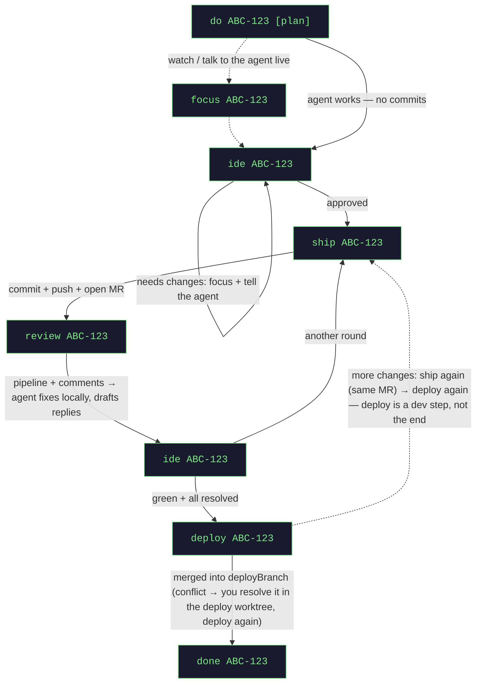

# jagt

**Turn one ticket into one AI coding agent — and stay in control of every push.**

jagt takes a ticket from your issue tracker and hands it to an autonomous AI coding agent — any MCP-capable
CLI ([Claude Code](https://claude.com/claude-code) by default; Codex, Qwen, … via config) — working in its
own isolated Git worktree. You drive everything from a single **Master** console:
spin agents up, watch them, review, ship, deploy, tear down. Nothing leaves your machine — no push, merge,
merge request, or deploy — without a human checkpoint you own.

> **One console. One agent per ticket. Isolated worktrees. You approve every outward move.**

---

## How it works

- **Master console** — one terminal you type into (`do PROJ-42`, `ship`, `deploy`, …). It routes and
  tracks; it never writes code. It is plain Java, not an AI session: commands are parsed by a fixed
  grammar and executed in-process — instant, no tokens, no drift.
- **Sub-agents** — one agent session per ticket, each in its own Git worktree (a sibling checkout on a task
  branch). They can't see each other's code and can't touch your base branch — jagt enforces it.
- **You, the human in the loop** — jagt never commits to a shared branch, opens a merge request, or deploys
  on its own. Three checkpoints are always yours: **review · CI · close**.
- **Durable state** — a small backend tracks each task through its lifecycle
  (`NEW → IN_PROGRESS → REVIEW_PENDING → CI_POLLING → DEPLOYED → DONE`) and guards Git so an agent can only
  ever act on its own branch.

Agents run as background sessions inside one terminal window that opens for you automatically, so they keep
working even if you close the viewer. The terminal, editor, and notifier are **swappable strategies** — the
concept is OS-agnostic; today it ships tuned for macOS.

---

## What jagt works with

jagt orchestrates four kinds of tool. Each is an **abstraction, not a brand** — jagt hardcodes none of
them; it relies only on whatever MCP your session exposes, so the concrete vendor is yours to pick.

- **Issue tracker** — where tickets live. Jira, Linear, GitHub Issues, or a plain URL to anything: a ticket
  is just an id, a title, and (maybe) a link to open.
- **Version-control host** — where branches, pushes, and review requests live. GitLab, GitHub, Bitbucket —
  any `http(s)` git remote and its merge/pull requests. Optionally jagt also READS one directly
  (`orchestrator.code-host.type=gitlab`) so review sweeps cost no model call; it never writes there.
- **AI coding agent** — the per-ticket worker session. Claude Code (default) or Codex today, any MCP-capable
  CLI in principle: one runtime class each. Note that a Codex worktree gets jagt's MCP proxy but not your own
  MCP servers (Codex reads them from `$CODEX_HOME`, which jagt points at the worktree).
- **Terminal** — the window your agents run in, and where you drive the Master console. kitty or Warp.

Plus an **editor** (IntelliJ IDEA today) and a **desktop notifier** for the human checkpoints. Every one of
these is a swappable strategy: add a vendor by implementing an interface and naming it in config — never by
editing the task flow.

---

## Quick start

```bash
cp config.json.dist config.json          # add your project(s) — see Configuration
cd orchestrator-backend
./gradlew build
java -jar build/libs/jagt.jar
```

You're now at the `jagt>` console. Type `help`, or `do <ticket>` to start your first agent.
Check the backend any time: `curl -s localhost:8290/state`.

> Run the jar in a **real terminal tab** — the console is a full-screen TUI showing your command output, a
> live task dashboard, and the input line together. (`./gradlew bootRun` also works but Gradle captures
> stdout, so with no TTY it degrades to a plain line-by-line REPL.)

---

## Installation

Prerequisite for any OS: your agent CLI (Claude Code by default) must already have MCP access to the systems
the agents use — your issue tracker (Jira, …) and code host (GitLab/GitHub). jagt itself talks to no external
service.

### macOS

| tool | install | used for |
|------|---------|----------|
| Java 25+ | `sdk install java 25-tem` | the backend / Master console |
| an agent CLI | [Claude Code](https://claude.com/claude-code) (`orchestrator.agent=claude`, default) or the Codex CLI (`=codex`) | the agents |
| tmux | `brew install tmux` | persistent agent sessions |
| Node 18+ | `brew install node` | the MCP proxy jagt injects into worktrees |
| git | Xcode CLT or `brew install git` | worktrees |
| IntelliJ IDEA | JetBrains Toolbox | the `ide` review checkpoint |
| kitty | `brew install kitty` | default agents terminal (swap it in config) |
| terminal-notifier | `brew install terminal-notifier` | reliable notifications (osascript fallback is often silently suppressed) |

### Linux

| tool | install | used for |
|------|---------|----------|
| Java 25+ | `sdk install java 25-tem` | the backend / Master console |
| an agent CLI | [Claude Code](https://claude.com/claude-code) — default; swap via `orchestrator.agent` | the agents |
| tmux | `apt install tmux` | persistent agent sessions |
| Node 18+ | `apt install nodejs` | the MCP proxy jagt injects into worktrees |
| git | `apt install git` | worktrees |
| kitty | `apt install kitty` | agents terminal |
| libnotify | `apt install libnotify-bin` | desktop notifications (`notify-send`) |
| an editor CLI | IntelliJ `idea` or VS Code `code` on PATH | the `ide` review checkpoint |

Then set `orchestrator.platform: linux` in `application.yml` (it selects the notifier and the terminal
driver) and point `orchestrator.editor-command` at your editor, e.g. `[idea]` or `[code]`. Everything else is
shared with macOS — kitty is driven by the same remote-control protocol on both.

A few macOS-specific setup notes:

- **IntelliJ run configs** — a fresh worktree opens without the base project's run configs. Mark a config
  *Store as project file* (Run → Edit Configurations) so it lands under `.run/`; jagt copies those into every
  worktree, so `ide` opens ready to run.
- **MCP pre-approval** — every agent worktree gets a generated `.claude/settings.local.json` pre-approving
  jagt's MCP tools and the agent's own git, so nothing stalls on an invisible permission prompt nobody is
  watching. (The committed root `.claude/settings.json` does the same for a Claude session working *on*
  jagt itself; the Master console needs no permissions — it's Java.)
- **UTF-8 locale (kitty)** — kitty honors the libc locale, and macOS has no `C.UTF-8`. If your shell locale
  isn't a real UTF-8 one, kitty drops non-ASCII input (Cyrillic paste/dictation). Fix:
  `export LANG=en_US.UTF-8` in `~/.zshenv`.

---

## Usage

jagt has two control surfaces over the same core, chosen with `orchestrator.ui`: the **board** (`web`, the
default) and the **console** (`tui`) — or `both`, which serves the board and then hands the terminal to the
console. Whatever you use, a task's phase, whose move it is and which actions are legal are computed in ONE
place, so the two can never tell you different things.

### The board (default)

Open `http://localhost:8290`. Tasks sit in columns by phase — **build → review → check → ready → deploy** —
each card showing whose move it is, the status **and how long it has been in it** (hover for the full timeline
of steps the task took), what jagt has spent on it, and links to the ticket and the review request. A card also
says when the agent has left **drafted review replies** in its worktree — read them before you ship, because
`ship` is what posts them. Every card carries exactly the actions that are legal for it right now,
the obvious one highlighted: open the IDE, focus the agent's terminal, ship, check the review, deploy, close.
`New task` does what `do ABC-42` does. Sort within columns by last activity, tokens, alias or title, and tick
*waiting on me* to see only the tasks that are actually yours. It updates itself — the backend pushes a change
event, the page does not poll — and `deploy`/`done` ask for confirmation, because one writes to a shared
branch and the other deletes a worktree.

### The console

`orchestrator.ui=tui` gives the full-screen terminal UI instead. Its dashboard repaints the moment an agent
reports in (the timer only refreshes the relative clock), tells you how long each task has been in its current
status, and points at drafted review replies when the agent has written any. Talk to it:

| command | effect |
|---------|--------|
| `do <ticket> [plan] [notes]` | fetch the ticket, spin up a sub-agent in an isolated worktree; `plan` = plan mode |
| `status` | show the task dashboard |
| `stats` | token spend of jagt's **own** model calls, per task (a sub-agent's session is invisible to jagt) |
| `focus <ticket>` | jump to the agent's session — **talk to the agent directly there** |
| `ide <ticket>` | open the worktree as a project (**Git → Local Changes** = live diff). `ide <ticket> diff` opens a static snapshot vs the `deployBranch` (falls back to `baseBranch`) — does not auto-refresh |
| `review <ticket>` | pull the MR's pipeline + comments; the agent fixes locally and drafts replies (nothing pushed) |
| `ship <ticket>` | approved: jagt itself commits (title from `mrTitlePattern`), pushes the task branch and opens or updates the review request over the code host's API — no model involved, so nothing can stall or reword it. Only the drafted replies stay with the agent, as a follow-up. Without `orchestrator.code-host` configured it falls back to instructing the agent, as before |
| `resume <mr-url>` | reopened merge request: resume its branch with existing commits and link that MR → `CI_POLLING` (no new MR) |
| `deploy <ticket>` | merge the task branch into `deployBranch` and push. On conflict nothing is pushed: the task goes `DEPLOY_CONFLICT`, `ide <ticket>` opens the **deploy** worktree — resolve, `git add`, then `deploy` again |
| `respawn <ticket>` | restart a dead agent session |
| `done <ticket>` | close the task: full cleanup — session, worktree, state (branch kept) |
| `prune [all]` | list the LOCAL branches already merged into `deployBranch` (a dry run); `prune all` deletes them. Never touches a remote branch, a live task's branch, or your base/deploy branch. A **squash**-merged branch looks unmerged to git, so it is never listed — jagt cannot prove the work survived. The list is every merged local branch, not only the ones jagt created: read it before typing `all` |
| `help` | command reference + recovery cheatsheet |

The task dashboard is always on screen and refreshes on its own (`dashboard.refreshSeconds`). Agents live in one terminal window — switch between them
with **Shift+←/→** or by clicking a task in the status bar. Every task also gets a short alias (`p1`, `s2`)
you can use in any command instead of the ticket id. Plain text any time: `curl -s localhost:8290/status`,
`curl -s localhost:8290/stats`, `curl -s localhost:8290/orphans`.
Closing the terminal window only detaches the viewer — agents keep running; kill them explicitly with `done`.

### The ideal flow

jagt validates command order against task status and refuses a move that makes no sense (e.g. `ship` on a
task that has neither work in progress nor an existing merge request). Dashed = optional.



The `ship → review → ide → ship` loop repeats once per review round (bot + human comments, CI) until CI is
green and every thread is resolved — then `deploy`, then `done`.

### Your role — the human in the loop

jagt never acts on the MR or CI by itself. Three checkpoints are explicitly yours (and the roadmap for
future automation):

| checkpoint | when | you run |
|------------|------|---------|
| **Review** | agent reached `REVIEW_PENDING`, and after every review round | `ide` → then `ship` (or `focus` to iterate live) |
| **CI / progress** | after `ship` | `review` — or set `autoReview.enabled` and jagt polls for you within a bounded window (it only READS and DRAFTS; it never posts, pushes or deploys) |
| **Close** | CI green, reviewers satisfied | `done` |

---

## Configuration

`config.json` is yours (gitignored, copied from `config.json.dist`). It's re-read on every access — no
restart needed.

Keys are grouped into logical sections; a whole section may be omitted (each key falls back to its default).

| key | meaning |
|-----|---------|
| `viewer.tmuxSession` | name of the agents' session (default `jagt`) |
| `viewer.viewMode` | `shared` = all tasks in one tab; `tab-per-task` = one terminal tab per task |
| `viewer.keepViewer` | keep the agents window open after the last task (default `true`) |
| `dashboard.refreshSeconds` | how often the dashboard refreshes, in seconds (default `10`) |
| `dashboard.reservedRows` | rows reserved for command output + input below the dashboard (default `17`) |
| `codeReview.mrTitlePattern` | MR/commit title template, placeholders `{ticket}` `{title}` (default `{ticket} {title}`) |
| `codeReview.postReviewReplies` | on `ship`, auto-post the agent's replies to MR threads (default `true`); `false` keeps them in `review_replies.md` |
| `codeReview.reviewReplyAuthors` | non-empty = auto-post replies ONLY to threads whose author matches one (e.g. `["coderabbit"]`); empty = all authors |
| `codeReview.mergeRequestDefaults` | `removeSourceBranch` / `squash` flags for created MRs (default both `true`) |
| `autoReview.enabled` | after `ship`, poll the MR automatically (approval → `APPROVED`; comments → drafted for you, never posted). Default `false` (opt-in) |
| `autoReview.windowHours` | how long auto-polling runs after the MR opens; then it stops and pings you to `review` manually (default `24`) |
| `autoReview.minIntervalMinutes` | poll interval at the window START — tightest cadence (default `10`) |
| `autoReview.maxIntervalMinutes` | poll interval at the window END — the cap, ≈ hourly; interval ramps linearly min→max (default `60`) |
| `agent.outputStyle` | optional output style for the agent (Claude Code), e.g. `acme:engineer` (default empty = the agent's own style) |
| `worktree.copyGlobs` | globs of gitignored local files copied into each worktree so the app runs (default `["**/.env"]`; add keys/certs) |
| `projects.<key>.path` | absolute path to the base repository |
| `projects.<key>.baseBranch` | branch new task branches start from, e.g. `origin/main` (read-only; jagt never pushes here) |
| `projects.<key>.deployBranch` | target of `deploy`, e.g. `dev` (omit to disable deploy) |
| `projects.<key>.labels` | hints for mapping tickets to this project |

Machine/OS-level settings live in `orchestrator-backend/src/main/resources/application.yml` (restart to apply):

| key | meaning |
|-----|---------|
| `orchestrator.ui` | control surface: `web` (default, board at `localhost:<port>`), `tui` (full-screen console) or `both` |
| `orchestrator.platform` | platform strategies — `macos` (default) or `linux`; selects the notifier and which kitty driver is used |
| `orchestrator.notify-send-command` | Linux only: the `notify-send` binary (default `notify-send`) |
| `orchestrator.terminal` | agents viewer: `kitty` (default) or `warp`; both run over tmux |
| `orchestrator.kitty-font-size` | viewer font size for the kitty terminal (blank keeps kitty.conf's own) |
| `orchestrator.editor-command` | editor launcher list (default `[/Applications/IntelliJ IDEA.app/Contents/MacOS/idea]`; e.g. `[code]`) |
| `orchestrator.editor-diff-command` | diff launcher for `ide <ticket> diff` |
| `orchestrator.agent` | which AI agent runtime — `claude` (default) or `codex`; the pluggable seam, one class per CLI (plus `stub` for the e2e matrix) |
| `orchestrator.claude-command` | the `claude` binary — the agent runtime AND the master assistant's headless reads (default `claude`) |
| `orchestrator.codex.command` | the `codex` binary for `orchestrator.agent=codex` (default `codex`) |
| `orchestrator.assistant.setting-sources` | MCP/settings the `do` ticket-read inherits (default `user,project,local`) |
| `orchestrator.assistant.model` | model for every master-assistant read — ticket, MR, review sweep (default `haiku`: ~$0.06 a call vs ~$0.41 on the inherited default; blank = your default) |
| `orchestrator.assistant.permission-mode` | lifts the headless permission gate so the ticket-read can call MCP (default `bypassPermissions`) |
| `orchestrator.assistant.allowed-tools` | comma-separated `mcp__<server>` allow-list; scopes the bypass, takes precedence over permission-mode |
| `orchestrator.code-host.type` | read review sweeps over the host's REST API instead of a paid model call: `gitlab`, or blank = off (default) |
| `orchestrator.code-host.base-url` | the host root, e.g. `https://gitlab.example.com`; a review URL is only read under this prefix |
| `orchestrator.code-host.token` | read-only API token (env, e.g. `CODE_HOST_TOKEN`) — jagt only GETs: never a push, merge or comment |
| `orchestrator.stub.script` | only for `orchestrator.agent=stub` (the scripted runtime used by `./gradlew e2eTest`): executable run instead of an agent |
| `orchestrator.agent-disabled-plugins` | plugins disabled per agent worktree (default empty) |
| `orchestrator.agent-prompt` | bootstrap prompt every sub-agent starts with |
| `orchestrator.tmux-command` | tmux binary (default `/opt/homebrew/bin/tmux`) |
| `orchestrator.open-warp-window` | auto-open the agents terminal window (`false` in tests) |
| `orchestrator.watchdog.stale-after` | silence threshold before an "agent unresponsive" alert (default `5m`) |
| `orchestrator.root` / `ORCHESTRATOR_ROOT` | override the auto-detected root (nearest dir with `mcp_client.js`) |

---

## Troubleshooting

| symptom | what happened | what to do |
|---------|---------------|------------|
| Task stuck at `SHIPPING`, no MR appears | the agent died mid-ship (crash / API 5xx / 529 Overloaded) before reaching `CI_POLLING` | `ship <ticket>` **again** — jagt sees the dead agent and respawns it to finish. (If it's still alive, `ship` refuses; `focus` to watch.) |
| Agent seems hung, or nothing happens after `ship`/`review` | session is waiting on input, hit an API error, or its window died | `focus <ticket>` to see what it's doing; `respawn <ticket>` restarts a dead session (re-reads `task_context.md`); `done <ticket>` abandons it entirely |
| `API Error: 529 Overloaded` | transient model overload, server-side | wait a moment and re-run; task state is unchanged |
| `deploy` says `MERGE CONFLICT` | task branch and `deployBranch` changed the same lines; jagt merges in a throwaway worktree, so nothing is pushed and the task goes `DEPLOY_CONFLICT` | `ide <ticket>` opens that **deploy** worktree (not the task's) — resolve the conflicts, `git add` them, then `deploy <ticket>` again; jagt finishes the commit + push. Your task branch and its MR are untouched |
| Nothing pastes / dictation dropped in a kitty window | non-UTF-8 shell locale | see the UTF-8 locale note under **Installation → macOS** |
| `state.json` got corrupted (bad hand edit, half-written by another tool) | every write keeps the previous version as `state.json.bak` | jagt recovers the tasks from the backup by itself, moves the bad file to `state.json.corrupt` and says so in the log. If the backup is gone too it REFUSES to start with an empty task list — fix or move the file yourself, nothing is silently overwritten |
| A worktree directory nobody is using is still on disk | a crashed or abandoned task, or a `done` that could not delete it | jagt pings you once at startup and lists them with `curl -s localhost:8290/orphans`, including how many copied secret files (`worktree.copyGlobs`) are still inside. It never deletes them — they can hold uncommitted work, so that call is yours |
