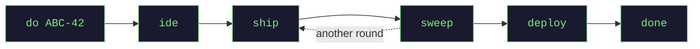

<h1 align="center">jagt</h1>

<p align="center">
  <b>One ticket → one AI agent → one Git worktree.<br>You approve every push.</b>
</p>

<p align="center">
  <a href="https://github.com/GulDmitry/jagt/actions/workflows/ci.yml"></a>
  
  
  <a href="LICENSE"></a>
</p>

jagt hands a ticket to an autonomous AI coding agent — [Claude Code](https://claude.com/claude-code) by
default, Codex or any MCP-capable CLI — running in its own isolated Git worktree, so two agents cannot see or
break each other's work. You drive all of them from one place: a board in your browser, or a full-screen
console in your terminal.

**Nothing leaves your machine without you.** No push, no merge request, no deploy.



## Start

**Check this before installing anything.** jagt reads a ticket by spawning a *headless* one-shot of your agent
CLI, and a headless session cannot log in interactively or load a plugin-scoped MCP server. So your tracker and
code host must be reachable through **token-based** MCP servers. `claude mcp list` calling one "connected" does
not settle it — [how to check, and what to do if not](docs/installation.md#mcp-access-comes-first).

```bash
cp jagt.yml.dist jagt.yml           # fill in ONE project: path, baseBranch, deployBranch
cd orchestrator-backend
./gradlew build stageJar
java -jar build/libs/jagt-run.jar   # --orchestrator.ui=tui for the console instead
```

Open **http://localhost:8290**, type a ticket key or URL in the first field, press **Start**.

That is the whole setup — every other key has a default. If anything is missing, jagt refuses to start and
prints the **whole** list of problems at once, each line naming the key that fixes it.

You also need Java 25, tmux, git, kitty and an agent CLI → [Installation](docs/installation.md).

> [!IMPORTANT]
> Run the **staged** jar (`jagt-run.jar`), never `jagt.jar`. `./gradlew build` rewrites `jagt.jar` in place, so
> a running instance starts failing with `NoClassDefFoundError`. Staging writes a fresh file each time.

## Commands

| command | what it does |
|---------|--------------|
| `do ABC-42` | read the ticket, cut a worktree, launch an agent |
| `ide ABC-42` | open the worktree in your editor — the live diff |
| `focus ABC-42` | jump into the agent's session and talk to it |
| `ship ABC-42` | commit, push, open or update the review request |
| `sweep ABC-42` | pull checks + comments; the agent fixes locally and drafts replies |
| `replies ABC-42` | read those drafted replies before they go out |
| `deploy ABC-42` | merge the task branch into the deploy branch |
| `done ABC-42` | close the task and clean everything up |

Every one is also a button on the board, and `Help` there explains what its colours and marks mean. Free text
works too (`⌘K`) — a model maps it onto exactly one of these commands, which then runs through the same gate
the button uses. → [Full usage guide](docs/usage.md)

## Your three checkpoints

jagt stops and waits for you at exactly three points. Nothing between them reaches the outside world.

| checkpoint | when | you run |
|------------|------|---------|
| **Review** | the agent is done, and after every review round | `ide`, then `ship` |
| **CI** | after `ship` | `sweep` — or let jagt poll for you (it only reads and drafts) |
| **Close** | checks green, reviewers satisfied | `done` |

## What you own

- The base branch is **read-only**. Nothing in jagt ever pushes to it.
- The only writes to a shared branch are `deploy` and its undo `revert` — both yours to trigger, never
  automatic, and `revert` adds a commit rather than rewriting history.
- An agent acts on **its own task only**, enforced by the server rather than by a prompt.
- Commands are parsed and run in plain Java. **No model call, no tokens, no drift** — the only calls that spend
  are a ticket read, a review round, and a `⌘K` line.
- The board listens on `127.0.0.1`. It asks for no password and can deploy, so it stays on loopback until you
  decide otherwise.
- No git hooks. Ever.

Agents live in tmux and the whole state is one JSON file, so restarting the backend loses nothing.

## Swapping a vendor

Agent CLI, terminal, editor and notifier are each an interface with one implementation per vendor — Claude Code
or Codex, kitty or Warp, IntelliJ, a desktop notifier. The tracker and the code host are not jagt's at all: they
are whatever **your own** MCP servers reach, and jagt holds no credential for either. Adding one means
implementing an interface and naming it in config, never editing the task flow.
→ [Configuration](docs/configuration.md)

## Documentation

| | |
|---|---|
| [Installation](docs/installation.md) | prerequisites for macOS and Linux, first-run setup |
| [Usage](docs/usage.md) | the board, the console, every command, the review loop |
| [Configuration](docs/configuration.md) | where a setting goes, and every key there is |
| [Troubleshooting](docs/troubleshooting.md) | symptom → cause → fix |
| [Development](docs/development.md) | test suites, CI, running the Linux suite from a Mac |
| [Architecture](ARCHITECTURE.md) | the code map — what kinds of thing jagt has, and where a new one goes |
| [Use cases](USE-CASES.md) | one-line answers to specific situations |

## License

[Apache 2.0](LICENSE)
