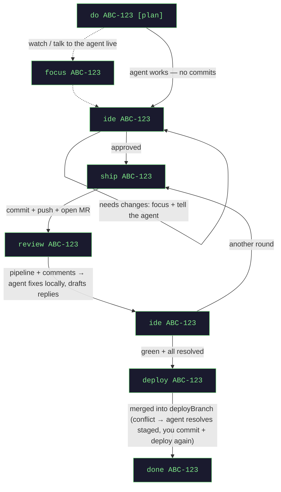

# jagt

**Turn one ticket into one AI coding agent — and stay in control of every push.**

jagt takes a ticket from your issue tracker and hands it to an autonomous AI coding agent — any MCP-capable
CLI ([Claude Code](https://claude.com/claude-code) by default; Codex, Qwen, … via config) — working in its
own isolated Git worktree. You drive everything from a single **Master** console:
spin agents up, watch them, review, ship, deploy, tear down. Nothing leaves your machine — no push, merge,
merge request, or deploy — without a human checkpoint you own.

> **One console. One agent per ticket. Isolated worktrees. You approve every outward move.**

---

## How it works

- **Master console** — one terminal you type into (`do PROJ-42`, `ship`, `deploy`, …). It routes and
  tracks; it never writes code.
- **Sub-agents** — one agent session per ticket, each in its own Git worktree (a sibling checkout on a task
  branch). They can't see each other's code and can't touch your base branch — jagt enforces it.
- **You, the human in the loop** — jagt never commits to a shared branch, opens a merge request, or deploys
  on its own. Three checkpoints are always yours: **review · CI · close**.
- **Durable state** — a small backend tracks each task through its lifecycle
  (`NEW → IN_PROGRESS → REVIEW_PENDING → CI_POLLING → DEPLOYED → DONE`) and guards Git so an agent can only
  ever act on its own branch.

Agents run as background sessions inside one terminal window that opens for you automatically, so they keep
working even if you close the viewer. The terminal, editor, and notifier are **swappable strategies** — the
concept is OS-agnostic; today it ships tuned for macOS.

---

## Quick start

```bash
cp config.json.dist config.json          # add your project(s) — see Configuration
cd orchestrator-backend
./gradlew build
java -jar build/libs/jagt.jar
```

You're now at the `jagt>` console. Type `help`, or `do <ticket>` to start your first agent.
Check the backend any time: `curl -s localhost:8290/state`.

> Run the jar in a **real terminal tab** — the console is a full-screen TUI showing your command output, a
> live task dashboard, and the input line together. (`./gradlew bootRun` also works but Gradle captures
> stdout, so with no TTY it degrades to a plain line-by-line REPL.)

---

## Installation

Prerequisite for any OS: your agent CLI (Claude Code by default) must already have MCP access to the systems
the agents use — your issue tracker (Jira, …) and code host (GitLab/GitHub). jagt itself talks to no external
service.

### macOS

| tool | install | used for |
|------|---------|----------|
| Java 25+ | `sdk install java 25-tem` | the backend / Master console |
| an agent CLI | [Claude Code](https://claude.com/claude-code) — default; swap via `orchestrator.agent` | the agents |
| tmux | `brew install tmux` | persistent agent sessions |
| Node 18+ | `brew install node` | the MCP proxy jagt injects into worktrees |
| git | Xcode CLT or `brew install git` | worktrees |
| IntelliJ IDEA | JetBrains Toolbox | the `ide` review checkpoint |
| kitty | `brew install kitty` | default agents terminal (swap it in config) |
| terminal-notifier | `brew install terminal-notifier` | reliable notifications (osascript fallback is often silently suppressed) |

A few macOS-specific setup notes:

- **IntelliJ run configs** — a fresh worktree opens without the base project's run configs. Mark a config
  *Store as project file* (Run → Edit Configurations) so it lands under `.run/`; jagt copies those into every
  worktree, so `ide` opens ready to run.
- **MCP pre-approval** — the committed `.claude/settings.json` pre-approves jagt's MCP tools for the Master
  session, so tool calls aren't silently blocked. Keep it.
- **UTF-8 locale (kitty)** — kitty honors the libc locale, and macOS has no `C.UTF-8`. If your shell locale
  isn't a real UTF-8 one, kitty drops non-ASCII input (Cyrillic paste/dictation). Fix:
  `export LANG=en_US.UTF-8` in `~/.zshenv`.

---

## Usage

Talk to the Master console:

| command | effect |
|---------|--------|
| `do <ticket> [plan] [notes]` | fetch the ticket, spin up a sub-agent in an isolated worktree; `plan` = plan mode |
| `status` | show the task dashboard |
| `focus <ticket>` | jump to the agent's session — **talk to the agent directly there** |
| `ide <ticket>` | open the worktree as a project (**Git → Local Changes** = live diff). `ide <ticket> diff` opens a static snapshot vs the `deployBranch` (falls back to `baseBranch`) — does not auto-refresh |
| `review <ticket>` | pull the MR's pipeline + comments; the agent fixes locally and drafts replies (nothing pushed) |
| `ship <ticket>` | approved: agent commits, pushes, opens the merge request, watches CI |
| `deploy <ticket>` | merge the task branch into `deployBranch` and push (on conflict the agent resolves it staged-but-uncommitted; you review, commit, `deploy` again) |
| `respawn <ticket>` | restart a dead agent session |
| `done <ticket>` | close the task: full cleanup — session, worktree, state (branch kept) |
| `help` | command reference + recovery cheatsheet |

Every Master reply ends with the task dashboard. Agents live in one terminal window — switch between them
with **Shift+←/→** or by clicking a task in the status bar. Every task also gets a short alias (`p1`, `s2`)
you can use in any command instead of the ticket id. Plain-text status any time: `curl -s localhost:8290/status`.
Closing the terminal window only detaches the viewer — agents keep running; kill them explicitly with `done`.

### The ideal flow

The Master validates command order against task status (override with `force`). Dashed = optional.



The `ship → review → ide → ship` loop repeats once per review round (bot + human comments, CI) until CI is
green and every thread is resolved — then `deploy`, then `done`.

### Your role — the human in the loop

jagt never acts on the MR or CI by itself. Three checkpoints are explicitly yours (and the roadmap for
future automation):

| checkpoint | when | you run |
|------------|------|---------|
| **Review** | agent reached `REVIEW_PENDING`, and after every review round | `ide` → then `ship` (or `focus` to iterate live) |
| **CI / progress** | after `ship` (nothing polls automatically) | `review` |
| **Close** | CI green, reviewers satisfied | `done` |

---

## Configuration

`config.json` is yours (gitignored, copied from `config.json.dist`). It's re-read on every access — no
restart needed.

Keys are grouped into logical sections; a whole section may be omitted (each key falls back to its default).

| key | meaning |
|-----|---------|
| `viewer.tmuxSession` | name of the agents' session (default `jagt`) |
| `viewer.viewMode` | `shared` = all tasks in one tab; `tab-per-task` = one terminal tab per task |
| `viewer.keepViewer` | keep the agents window open after the last task (default `true`) |
| `dashboard.refreshSeconds` | how often the dashboard refreshes, in seconds (default `10`) |
| `dashboard.reservedRows` | rows reserved for command output + input below the dashboard (default `17`) |
| `codeReview.mrTitlePattern` | MR/commit title template, placeholders `{ticket}` `{title}` (default `{ticket} {title}`) |
| `codeReview.postReviewReplies` | on `ship`, auto-post the agent's replies to MR threads (default `true`); `false` keeps them in `review_replies.md` |
| `codeReview.reviewReplyAuthors` | non-empty = auto-post replies ONLY to threads whose author matches one (e.g. `["coderabbit"]`); empty = all authors |
| `codeReview.mergeRequestDefaults` | `removeSourceBranch` / `squash` flags for created MRs (default both `true`) |
| `agent.outputStyle` | optional output style for the agent (Claude Code), e.g. `acme:engineer` (default empty = the agent's own style) |
| `worktree.copyGlobs` | globs of gitignored local files copied into each worktree so the app runs (default `["**/.env"]`; add keys/certs) |
| `projects.<key>.path` | absolute path to the base repository |
| `projects.<key>.baseBranch` | branch new task branches start from, e.g. `origin/main` (read-only; jagt never pushes here) |
| `projects.<key>.deployBranch` | target of `deploy`, e.g. `dev` (omit to disable deploy) |
| `projects.<key>.labels` | hints for mapping tickets to this project |

Machine/OS-level settings live in `orchestrator-backend/src/main/resources/application.yml` (restart to apply):

| key | meaning |
|-----|---------|
| `orchestrator.platform` | notifier strategy (default `macos`) |
| `orchestrator.terminal` | agents viewer: `kitty` (default) or `warp`; both run over tmux |
| `orchestrator.editor-command` | editor launcher list (default `[open, -a, IntelliJ IDEA]`; e.g. `[code]`) |
| `orchestrator.editor-diff-command` | diff launcher for `ide <ticket> diff` |
| `orchestrator.agent` | which AI agent runtime — `claude` (default), and future MCP-capable CLIs; the pluggable seam |
| `orchestrator.claude-command` | binary for the `claude` runtime (default `claude`) |
| `orchestrator.assistant.setting-sources` | MCP/settings the `do` ticket-read inherits (default `user,project,local`) |
| `orchestrator.assistant.model` | model for the ticket-read (blank = your default) |
| `orchestrator.assistant.permission-mode` | lifts the headless permission gate so the ticket-read can call MCP (default `bypassPermissions`) |
| `orchestrator.assistant.allowed-tools` | comma-separated `mcp__<server>` allow-list; scopes the bypass, takes precedence over permission-mode |
| `orchestrator.agent-disabled-plugins` | plugins disabled per agent worktree (default empty) |
| `orchestrator.agent-prompt` | bootstrap prompt every sub-agent starts with |
| `orchestrator.tmux-command` | tmux binary (default `/opt/homebrew/bin/tmux`) |
| `orchestrator.open-warp-window` | auto-open the agents terminal window (`false` in tests) |
| `orchestrator.watchdog.stale-after` | silence threshold before an "agent unresponsive" alert (default `5m`) |
| `orchestrator.root` / `ORCHESTRATOR_ROOT` | override the auto-detected root (nearest dir with `mcp_client.js`) |

---

## Troubleshooting

| symptom | what happened | what to do |
|---------|---------------|------------|
| Task stuck at `SHIPPING`, no MR appears | the agent died mid-ship (crash / API 5xx / 529 Overloaded) before reaching `CI_POLLING` | `ship <ticket>` **again** — jagt sees the dead agent and respawns it to finish. (If it's still alive, `ship` refuses; `focus` to watch.) |
| Agent seems hung, or nothing happens after `ship`/`review` | session is waiting on input, hit an API error, or its window died | `focus <ticket>` to see what it's doing; `respawn <ticket>` restarts a dead session (re-reads `task_context.md`); `done <ticket>` abandons it entirely |
| `API Error: 529 Overloaded` | transient model overload, server-side | wait a moment and re-run; task state is unchanged |
| `deploy` says `MERGE CONFLICT — the agent is resolving it` | task branch and `deployBranch` changed the same lines; jagt merges in a throwaway worktree, so it aborts (nothing pushed) and hands the agent a resolve brief | wait for the agent, then `ide <ticket>` → **Git → Local Changes** shows the resolved-but-**uncommitted** merge → review and **commit yourself** → `deploy <ticket>` again |
| Nothing pastes / dictation dropped in a kitty window | non-UTF-8 shell locale | see the UTF-8 locale note under **Installation → macOS** |
