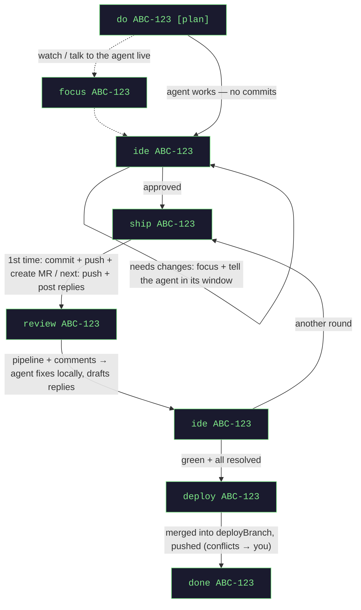

# jawo — Multi-Agent Dev Orchestrator

Delegate Jira tickets to Claude Code agents. A Spring Boot backend manages isolated Git worktrees and
task state; you talk to one **Master** session, it spawns one sub-agent per ticket. Agents run as tmux
windows inside a single Warp window that opens automatically.

macOS-only by design: Warp, IntelliJ IDEA, tmux, Claude Code CLI. Your Claude Code must already have
MCP access to the systems the agents need (Jira, GitLab/GitHub).

## Prerequisites

| tool | install |
|------|---------|
| Java 25+ | `sdk install java 25-tem` |
| tmux | `brew install tmux` |
| terminal-notifier | `brew install terminal-notifier` (reliable macOS notifications; osascript fallback is often silently suppressed) |
| Node 18+ | `brew install node` |
| Claude Code CLI | claude.com/claude-code |
| kitty | `brew install kitty` (default agents terminal; or set `terminal: warp`) |
| Warp | warp.dev (only if `terminal: warp`) |
| IntelliJ IDEA | JetBrains Toolbox (see the run-config note below) |
| git | Xcode CLT / brew |

## Setup

```bash
cp config.json.dist config.json   # then fill in your projects
```

Agent tabs are opened via Warp Tab Configs (generated into `~/.warp/tab_configs/`, opened with
`warp://tab_config/<name>`) — no shell hooks needed.

IntelliJ run configs: a worktree opens without the base project's run configs. To carry them over,
mark a config "Store as project file" (Run → Edit Configurations) — it becomes a file under `.run/`
(or legacy `.idea/runConfigurations/`), and jawo copies those folders into every new worktree so
`ide` opens ready to run.

The committed `.claude/settings.json` pre-approves the orchestrator's MCP tools for the Master session
(so tool calls aren't silently blocked). Keep it — see [CLAUDE.md](CLAUDE.md) for the why and the
exact keys.

## Configuration

`config.json` (gitignored, yours — re-read on every access, no restart needed):

| key | meaning |
|-----|---------|
| `projects.<key>.path` | absolute path to the base repository |
| `projects.<key>.baseBranch` | branch new task branches start from, e.g. `origin/main` |
| `projects.<key>.deployBranch` | target of the `deploy` command, e.g. `dev` (omit to disable deploy) |
| `projects.<key>.labels` | hints for mapping tickets to the project |
| `tmuxSession` | name of the agents' tmux session (default `jawo`) |
| `viewMode` | `shared` = all tasks inside one tab; `tab-per-task` = a Warp tab per task |
| `keepViewer` | keep the agents tab/window open (reserved) after the last task (default `true`) — drag it into a group once and it stays |
| `mrTitlePattern` | MR/commit title template, placeholders `{ticket}` `{title}` (default `{ticket} {title}`) |
| `postReviewReplies` | on `ship`, auto-post the agent's replies to MR threads (default `true`); `false` keeps them in `review_replies.md` |
| `reviewReplyAuthors` | when non-empty, auto-post replies ONLY to threads whose author matches one (e.g. `["coderabbit"]`); empty = all authors |
| `agentOutputStyle` | optional Claude output style pinned into each agent worktree, e.g. `sob-ai:Engineer` (default empty = Claude's own style) |
| `mergeRequestDefaults` | `removeSourceBranch` / `squash` flags for created MRs (default both `true`) |

`orchestrator-backend/src/main/resources/application.yml` (machine/OS level, restart to apply):

| key | meaning |
|-----|---------|
| `orchestrator.platform` | notifier strategy, default `macos` (osascript) |
| `orchestrator.terminal` | agents viewer: `kitty` (default — titled/closable tabs, fast) or `warp`; both run over tmux |
| `orchestrator.kitty-command` | kitty binary, default `kitty` (only for `terminal: kitty`) |
| `orchestrator.editor-command` | editor launcher list, default `[open, -a, IntelliJ IDEA]`; e.g. `[code]` |
| `orchestrator.editor-diff-command` | diff launcher for `ide <ticket> diff`, default `[.../idea, diff]` (`open -a` can't diff) |
| `orchestrator.claude-command` | agent CLI, default `claude` |
| `orchestrator.assistant.setting-sources` | MCP/settings the `do` ticket-read inherits, default `user,project,local` (no MCP path hardcoded) |
| `orchestrator.assistant.model` | model for the ticket-read (blank = your default; a strong model is more reliable at the tool call) |
| `orchestrator.agent-disabled-plugins` | plugins disabled per agent worktree (default empty; opt-in for RAM-constrained setups) |
| `orchestrator.agent-prompt` | bootstrap prompt every sub-agent starts with |
| `orchestrator.tmux-command` | tmux binary, default `/opt/homebrew/bin/tmux` |
| `orchestrator.open-warp-window` | auto-open the terminal window (`false` in tests) |
| `orchestrator.watchdog.stale-after` | silence threshold before an "agent unresponsive" alert, default `5m` |
| `orchestrator.root` / `ORCHESTRATOR_ROOT` | override the auto-detected root (nearest dir with `mcp_client.js`) |

## Run

```bash
# tab 1 — backend
cd orchestrator-backend && ./gradlew bootRun

# tab 2 — Master
claude --append-system-prompt "$(cat master_prompt.md)"
```

The Master is a router — run it at low reasoning effort so it answers fast and doesn't deliberate
over simple commands (`/model` → low, or your CLI's effort setting).

## Usage`

Tell the Master:

| command | effect |
|---------|--------|
| `do <ticket> [plan] [notes]` | fetch the ticket, spin up a sub-agent in an isolated worktree; `plan` = plan mode |
| `status` | dashboard only |
| `respawn <ticket>` | restart a sub-agent session for an already-registered task |
| `done <ticket>` | close the task at any stage: full cleanup — window, worktree, state (branch kept) |
| `focus <ticket>` | jump to the task's agent window — **talk to the agent directly there** (no `feedback` command) |
| `ide <ticket>` | review checkpoint: diff window of changes vs base, no project (`ide <ticket> project` opens the full project to run) |
| `review <ticket>` | full MR sweep (pipeline + comments): agent fixes locally + drafts replies; nothing pushed |
| `deploy <ticket>` | merge the task branch into the project's `deployBranch` and push (conflicts → you) |
| `ship <ticket>` | review approved: commit as "<id>: <jira title>", push, open MR, watch CI |
| `help` | command reference + recovery cheatsheet |

Every Master reply ends with the task dashboard. Agents live in one Warp window. Switch between tasks
with **Shift+←/→**, or click a task name in the status bar (mouse mode is on). Plain-text status any
time: `curl localhost:8080/status`.

## The ideal flow (commands in order)

The Master validates the command order against the task status (override with "force"). Dashed = optional.



The `ship → review → ide → ship` loop repeats once per review round (bot + human comments, CI) until
CI is green and every thread is resolved — then `deploy`.

Notes: `[plan]` — agent plans first, you approve in its window. Between commands the agent does the
actual work (arrow labels). Every task gets a short alias (`p1`, `s2`) shown in the dashboard — use it
in any command instead of the ticket id. Any time: `status`, `focus <ticket>` (respawns the session if
it died), `respawn <ticket>`, `help`. Closing the Warp window only detaches the viewer — agents keep
running; kill sessions explicitly with `done`.

## Your role (the human in the loop)

The system never acts on the MR/CI by itself — three checkpoints are explicitly yours
(also the roadmap for future automation):

| # | role | when | command |
|---|------|------|---------|
| A | code review | agent committed (REVIEW_PENDING) and after every review round | `ide` → then `ship` (or `focus` to iterate in-session) |
| B | CI/CD + review progress | after `ship` (nothing polls automatically) | `review` |
| C | closing the loop | CI green, reviewers satisfied | `done` (full cleanup) |

## Internals

Architecture, fault-tolerance guarantees and engineering constraints: see [CLAUDE.md](CLAUDE.md).
