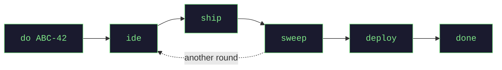

<h1 align="center">jagt</h1>

<p align="center">
  <b>One ticket → one agent session → one Git worktree.<br>You approve every push.</b>
</p>

<p align="center">
  <a href="https://github.com/GulDmitry/jagt/actions/workflows/ci.yml"></a>
  
  
  <a href="LICENSE"></a>
</p>

jagt hands a ticket to an autonomous AI coding agent in its own isolated Git worktree, so two agents cannot see
or break each other's work. You drive all of them from one board in your browser.

**Nothing leaves your machine without you.** No push, no merge request, no deploy.



## The session, and you

| the agent session | you |
|---|---|
| reads the ticket, writes the code, runs your tests | look at the live diff — `ide` |
| leaves **everything uncommitted** | `ship` — the first commit and push there is |
| fixes the CI failures and the comments, drafts every reply | read the drafts — `replies` — then `ship` |
| touches no shared branch and no other task | `deploy`, then `done` |

One session, one worktree, one branch, one review request. That it cannot reach another task is enforced by the
server, not by a prompt.

## Start

Every tool jagt needs, one link each: **[Technologies](docs/installation.md)**.

### 1 — check MCP access

jagt reads a ticket, and a review round, through a **headless** Claude Code session using *your* MCP servers.
A server behind an interactive login, or one from a plugin, answers no such call — while `claude mcp list`
still says "connected". Run this first:

```sh
cd "$TMPDIR" && claude "Name your MCP tools for <your tracker> and <your code host>, or say NONE." -p
```

`NONE` means jagt cannot read a ticket yet; [Installation](docs/installation.md) has the fix. Which CLI writes
the code is a separate choice.

### 2 — clone, and name one repository

```sh
git clone https://github.com/GulDmitry/jagt.git && cd jagt
cp jagt.yml.dist jagt.yml
```

`projects` is the only section with no default — without one jagt refuses to start:

```yaml
orchestrator:
  projects:
    widgets:
      path: /Users/you/work/widget-service   # absolute path to the repository
      baseBranch: origin/main                # tasks are cut from here, and it is never pushed to
      deployBranch: dev                      # omit to disable `deploy` for this project
  worktree:
    copyGlobs: ["**/.env"]                   # untracked files a fresh worktree needs to build
```

**`copyGlobs` is what makes a worktree usable.** A worktree is a clean checkout: whatever your build reads but
git does not track is missing until a pattern names it. Widen it until your tests pass *inside* one, knowing
each pattern copies those secrets to a sibling directory. Every other key ships with its value, described
in `jagt.yml.dist`.

### 3 — build, and run

```sh
cd orchestrator-backend
./gradlew build stageJar
java -jar build/libs/jagt-run.jar
```

Anything missing or half-configured and jagt refuses to start, printing the **whole** list at once, each line
naming the key that fixes it.

> [!IMPORTANT]
> Run the **staged** `jagt-run.jar`. `./gradlew build` rewrites `jagt.jar` in place, and a JVM still reading it
> dies with a `NoClassDefFoundError` that hides the real error — [Troubleshooting](docs/troubleshooting.md).

### 4 — open the board

**http://localhost:8290** — type a ticket key or URL in the first field, press **Start**. Setup ends here; from
now on you only add tasks.

## Commands

| command | what it does |
|---------|--------------|
| `do ABC-42` | read the ticket, cut a worktree, launch a session |
| `ide ABC-42` | open the worktree in your editor — the live diff |
| `focus ABC-42` | jump into the session and talk to it |
| `ship ABC-42` | commit, push, open or update the review request |
| `sweep ABC-42` | pull checks + comments; the agent fixes locally and drafts replies |
| `replies ABC-42` | read those drafted replies before they go out |
| `deploy ABC-42` | merge the task branch into the deploy branch |
| `done ABC-42` | close the task and clean everything up |

Each is a button on the board too, and `Help` there explains its colours and marks. A `⌘K` sentence is mapped
onto exactly one of them, through the same gate the button uses. `revert`, `respawn`, `resume`, `diff`,
`stats`, `activity` and `jobs` are in [Usage](docs/usage.md).

## What you keep

- The base branch is **read-only**; only `deploy` and its undo `revert` write a shared branch, both yours to
  trigger and neither rewriting history.
- **Nothing is written into your project's tracked files** — no git hook, nothing to uninstall.
- Sessions live in tmux and the state is one JSON file, so restarting the backend loses nothing.
- **Four things cost a model call**: a ticket, a merge request, a review round, a `⌘K` sentence.
- The board asks for no password and can deploy, so it stays on `127.0.0.1`.

It does not review the code, run your CI, hold a credential, or run on Windows.

## Documentation

| | |
|---|---|
| [Installation](docs/installation.md) | every technology, per platform, and the first run |
| [Usage](docs/usage.md) | the board, every command, the review loop |
| [Configuration](docs/configuration.md) | where a setting goes, and what outranks what |
| [Troubleshooting](docs/troubleshooting.md) | symptom → cause → fix |
| [Development](docs/development.md) | test suites, CI, running the Linux suite from a Mac |
| [Architecture](ARCHITECTURE.md) | the code map: what kinds of thing jagt has, and where a new one goes |

## License

[Apache 2.0](LICENSE)
