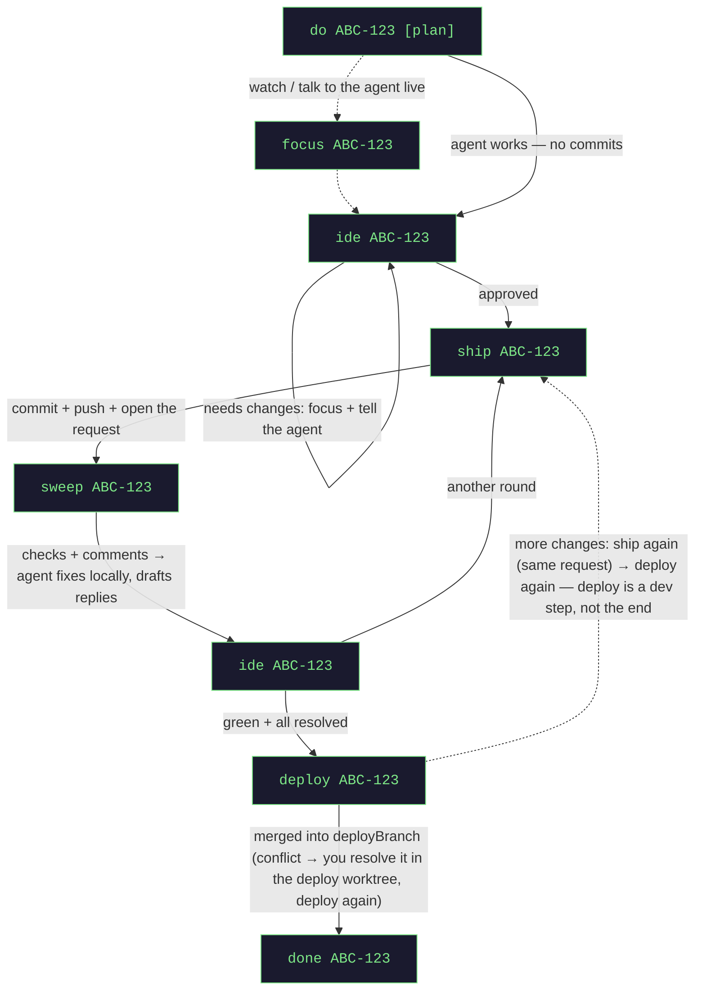

# jagt

**Turn one ticket into one AI coding agent — and stay in control of every push.**

jagt takes a ticket from your issue tracker and hands it to an autonomous AI coding agent — any MCP-capable
CLI ([Claude Code](https://claude.com/claude-code) by default; Codex, Qwen, … via config) — working in its
own isolated Git worktree. You drive everything from one place — a local **board** in the browser (default)
or the **Master** console in a terminal: spin agents up, watch them, review, ship, deploy, tear down. Nothing
leaves your machine — no push, merge, merge request, or deploy — without a human checkpoint you own.

> **One control surface. One agent per ticket. Isolated worktrees. You approve every outward move.**

---

## How it works

- **The Master** — the board's buttons and the console's commands (`do PROJ-42`, `ship`, `deploy`, …) are the
  same core: it routes and tracks, and never writes code. Plain Java, not an AI session — a command is parsed
  by a fixed grammar and executed in-process, so it is instant, costs no tokens and cannot drift. Free text is
  the one exception, and it only ever PROPOSES a command (see the dispatch note under Usage).
- **Sub-agents** — one agent session per ticket, each in its own Git worktree (a sibling checkout on a task
  branch). They can't see each other's code and can't touch your base branch — jagt enforces it.
- **You, the human in the loop** — jagt never commits to a shared branch, opens a merge request, or deploys
  on its own. Three checkpoints are always yours: **review · CI · close**.
- **Durable state** — a small backend tracks each task through its lifecycle
  (`NEW → IN_PROGRESS → REVIEW_PENDING → CI_POLLING → DEPLOYED → DONE`, plus `REVERTED` when a deploy is taken back out) and guards Git so an agent can only
  ever act on its own branch.

Agents run as background sessions inside one terminal window that opens for you automatically, so they keep
working even if you close the viewer. The terminal, editor, notifier and agent CLI are **swappable
strategies**: macOS is what jagt is developed on, and the Linux drivers ship with it — CI runs the task-flow
matrix and those drivers against real `notify-send`/kitty on every push (see Development).

---

## What jagt works with

jagt orchestrates four kinds of tool. Each is an **abstraction, not a brand** — jagt hardcodes none of
them; it relies only on whatever MCP your session exposes, so the concrete vendor is yours to pick.

- **Issue tracker** — where tickets live. Jira, Linear, GitHub Issues, or a plain URL to anything: a ticket
  is just an id, a title, and (maybe) a link to open. Optionally jagt also READS one directly
  (`orchestrator.tracker.type=jira`) so starting a task costs no model call; it never writes there.
- **Version-control host** — where branches, pushes, and review requests live. GitLab, GitHub, Bitbucket —
  any `http(s)` git remote and its merge/pull requests. Optionally jagt also READS one directly
  (`orchestrator.code-host.type=gitlab|github`) so review sweeps cost no model call; it never writes there.
- **AI coding agent** — the per-ticket worker session. Claude Code (default) or Codex today, any MCP-capable
  CLI in principle: one runtime class each. Note that a Codex worktree gets jagt's MCP proxy but not your own
  MCP servers (Codex reads them from `$CODEX_HOME`, which jagt points at the worktree).
- **Terminal** — the window your agents run in, and where you drive the Master console. kitty or Warp. The
  board can also show an agent's session inside itself (`orchestrator.web-terminal`, off by default), so
  `focus` is a click instead of a window switch.

Plus an **editor** (IntelliJ IDEA today) and a **desktop notifier** for the human checkpoints. Every one of
these is a swappable strategy: add a vendor by implementing an interface and naming it in config — never by
editing the task flow.

---

## Quick start

```bash
cp config.json.dist config.json          # add your project(s) — see Configuration
cd orchestrator-backend
./gradlew build stageJar
java -jar build/libs/jagt-run.jar
```

> Why `jagt-run.jar` and not `jagt.jar`: `./gradlew build` rewrites `jagt.jar` **in place**, so a jagt started
> from that path keeps reading a file whose content has changed — already-loaded classes work, everything
> loaded afterwards fails with `NoClassDefFoundError` and parts of the board start answering 500. `stageJar`
> writes a NEW `jagt-run-<stamp>.jar` each time and points `jagt-run.jar` at it, so the copy a running instance
> holds is never overwritten — rebuild and re-stage as often as you like; the running one keeps working until
> you restart it. (If something rewrites a jar anyway, jagt notices within a minute and says so.)

That serves the **board** at `http://localhost:8290` — the default surface. Open it and press `New task`
(or `⌘K` and say what you want). Plain text any time: `curl -s localhost:8290/state`.

Prefer typing? `java -jar build/libs/jagt.jar --orchestrator.ui=tui` gives the full-screen console instead
(`=both` serves the board and then hands the terminal to the console). Run the jar in a **real terminal tab**
for that: the console draws your command output, the live dashboard and the input line into one screen.
(`./gradlew bootRun` works too, but Gradle captures stdout, so with no TTY the console degrades to a plain
line-by-line REPL.)

---

## Installation

Prerequisite for any OS: your agent CLI (Claude Code by default) must already have MCP access to the systems
the agents use — your issue tracker (Jira, …) and code host (GitLab/GitHub). jagt itself talks to no external
service.

### macOS

| tool | install | used for |
|------|---------|----------|
| Java 25+ | `sdk install java 25-tem` | the backend / Master console |
| an agent CLI | [Claude Code](https://claude.com/claude-code) (`orchestrator.agent=claude`, default) or the Codex CLI (`=codex`) | the agents |
| tmux | `brew install tmux` | persistent agent sessions |
| Node 18+ | `brew install node` | ONLY for `orchestrator.agent=codex` — Codex spawns its MCP server, so it gets the stdio bridge. Claude Code talks to jagt over HTTP and needs no Node |
| git | Xcode CLT or `brew install git` | worktrees |
| IntelliJ IDEA | JetBrains Toolbox | the `ide` review checkpoint |
| kitty | `brew install kitty` | default agents terminal (swap it in config) |
| terminal-notifier | `brew install terminal-notifier` | reliable notifications, and CLICKABLE ones — a banner about a task opens the board filtered to it (osascript fallback is often silently suppressed and carries no click) |
| ttyd | `brew install ttyd` | ONLY for `orchestrator.web-terminal.enabled=true` — the agent's session shown inside the board |

### Linux

| tool | install | used for |
|------|---------|----------|
| Java 25+ | `sdk install java 25-tem` | the backend / Master console |
| an agent CLI | [Claude Code](https://claude.com/claude-code) — default; swap via `orchestrator.agent` | the agents |
| tmux | `apt install tmux` | persistent agent sessions |
| Node 18+ | `apt install nodejs` | ONLY for `orchestrator.agent=codex` (see the macOS table) |
| git | `apt install git` | worktrees |
| kitty | `apt install kitty` | agents terminal |
| libnotify | `apt install libnotify-bin` | desktop notifications (`notify-send`) |
| ttyd | `apt install ttyd` | ONLY for `orchestrator.web-terminal.enabled=true` — the agent's session shown inside the board |
| an editor CLI | IntelliJ `idea` or VS Code `code` on PATH | the `ide` review checkpoint |

Then set `orchestrator.platform: linux` in `application.yml` (it selects the notifier and the terminal
driver) and point `orchestrator.editor-command` at your editor, e.g. `[idea]` or `[code]`. Everything else is
shared with macOS — kitty is driven by the same remote-control protocol on both.

A few macOS-specific setup notes:

- **IntelliJ run configs** — a fresh worktree opens without the base project's run configs. Mark a config
  *Store as project file* (Run → Edit Configurations) so it lands under `.run/`; jagt copies those into every
  worktree, so `ide` opens ready to run.
- **MCP pre-approval** — every agent worktree gets a generated `.claude/settings.local.json` pre-approving
  jagt's MCP tools and the agent's own git, so nothing stalls on an invisible permission prompt nobody is
  watching. (The committed root `.claude/settings.json` does the same for a Claude session working *on*
  jagt itself; the Master console needs no permissions — it's Java.)
- **UTF-8 locale (kitty)** — kitty honors the libc locale, and macOS has no `C.UTF-8`. If your shell locale
  isn't a real UTF-8 one, kitty drops non-ASCII input (Cyrillic paste/dictation). Fix:
  `export LANG=en_US.UTF-8` in `~/.zshenv`.

---

## Usage

jagt has two control surfaces over the same core, chosen with `orchestrator.ui`: the **board** (`web`, the
default) and the **console** (`tui`) — or `both`, which serves the board and then hands the terminal to the
console. Whatever you use, a task's phase, whose move it is and which actions are legal are computed in ONE
place, so the two can never tell you different things.

### The board (default)

Open `http://localhost:8290`. Every task is one card in a grid ordered by **alias**, and it stays where it is:
a card never moves because a status changed, only when a task is created or closed. What the phases hold is one
line of counts above the grid — **build → review → check → ready → deploy → done**, zeros included — so the
pipeline is a number rather than a position nothing can keep still. Each card shows whose move it is, the status
**and how long it has been in it** (hover for the full timeline
of steps the task took), what jagt has spent on it, and links to the ticket and the review request. A card also
says when the agent has left **drafted review replies** in its worktree — read them before you ship, because
`ship` is what posts them. Every card carries exactly the actions that are legal for it right now,
the obvious one highlighted: open the IDE, focus the agent's terminal, ship, check the review, deploy, close.
`New task` does what `do ABC-42` does, and `Resume` does what `resume <request-url>` does — take over a review
request that already exists (reopened, or someone else's work): its branch comes back with the commits already
on it and the request is linked, not reopened. `Stats`, `Help` and `Activity` are the same commands
too — they open OVER the board in a dialog instead of taking you to another page.

**Focus** always selects the agent's tmux window. Where you then look at it is the difference between the two
surfaces: install ttyd and set `orchestrator.web-terminal.enabled: true`, and the board opens that session
**over the board itself** — a real terminal you can type into, so answering an agent's question no longer means
finding another window. Close the panel and the agent keeps working; it is only a view. With no web terminal
configured, `focus` does what it always did and tells you which window the session is in.

The one console verb the board deliberately does NOT have is `quit`: stopping the backend belongs to whoever
started the process (Ctrl-C, or kill it), not to a button in a browser. Nothing is lost either way — agents live
in tmux and keep working when the backend goes away.

**The board and the console can do the same things**; anything console-only is a bug. Per-task verbs — ship,
sweep, `ide` (including the deploy worktree when a deploy conflicted), deploy, revert, respawn, focus, done —
are the card's own buttons, because the server lists the legal ones per task and the board renders exactly that.
A card shows them in two rows: what moves the task along its life first (ship … done), then the ones that only
look at it or restart its agent (focus, open IDE, diff, restart agent).

There is no sort control: an order that follows activity moves a card on the agent's next keep-alive, and a
position you have learnt is worth more than any order a click can produce. What is offered instead is narrowing,
which changes the set only while a control visibly says so — type in the filter box (`/` focuses it, Escape
clears) to match an alias, a ticket number or a title, and tick *needs my action* for the tasks that are
yours. It updates itself — the backend pushes a change
event, the page does not poll — and `deploy`/`done` ask for confirmation, because one writes to a shared
branch and the other deletes a worktree.

### The console

`orchestrator.ui=tui` gives the full-screen terminal UI instead. Its dashboard repaints the moment an agent
reports in (the timer only refreshes the relative clock), tells you how long each task has been in its current
status, and points at drafted review replies when the agent has written any. Talk to it:

| command | effect |
|---------|--------|
| `do <ticket> [plan] [notes]` | fetch the ticket, spin up a sub-agent in an isolated worktree; `plan` = plan mode |
| `do <ticket> from <branch>` | same, but the worktree is cut from `<branch>` and its merge request targets `<branch>` instead of the project's `baseBranch` — for stacking a task on a parent feature branch. The branch must already exist on `origin`; `deploy` is unaffected (it still merges into `deployBranch`) |
| `do <ticket> <projA>,<projB>` | one change that moves two repositories: ONE task and ONE agent session, with a worktree in each (the session runs in the first named and edits the others in place). `ship` opens a request per repository and `sweep` reports them as one round — as far along as the least finished one. `deploy` is refused for such a task: a shared branch cannot be written half way. On the board, pick several projects in the launch row |
| `status` | show the task dashboard |
| `stats` | token spend of jagt's **own** model calls, per task (a sub-agent's session is invisible to jagt), then cycle time: how long each task has been waiting on you, on its agent and on the code host, and how many rounds it has been out for review |
| `focus <ticket>` | jump to the agent's session — **talk to the agent directly there** |
| `ide <ticket>` | open the worktree as a project (**Git → Local Changes** = live diff). `ide <ticket> diff` opens a static snapshot vs the `deployBranch` (a task started `from <branch>` diffs against that branch instead; falls back to `baseBranch`) — does not auto-refresh |
| `sweep <ticket>` | pull the request's checks + comments; the agent fixes locally and drafts replies (nothing pushed). The checks stay visible afterwards — a dot on the card, `CHECKS RED · …` on the console line, and one notification the first time a run goes red. `review` still works — the old spelling of the same verb |
| `ship <ticket>` | approved: jagt itself commits (title from `mrTitlePattern`), pushes the task branch and opens or updates the review request over the code host's API — no model involved, so nothing can stall or reword it. Only the drafted replies stay with the agent, as a follow-up. Without `orchestrator.code-host` configured it falls back to instructing the agent, as before |
| `resume <request-url>` | reopened review request: resume its branch with existing commits and link that request → `CI_POLLING` (no new one is opened). The request's own target branch is remembered, so the next `ship` updates it instead of opening a second one |
| `deploy <ticket>` | merge the task branch into `deployBranch` and push — always as a merge commit (`--no-ff`), which is what lets `revert` take the whole task back out in one go. On conflict nothing is pushed: the task goes `DEPLOY_CONFLICT`, `ide <ticket>` opens the **deploy** worktree — resolve, `git add`, then `deploy` again |
| `revert <ticket>` | undo that deploy: revert the merge commit it created on `deployBranch` and push the revert → `REVERTED`. Only adds a commit (no history rewrite, no force-push) and leaves your branch and its commits intact, so the normal follow-up is fix + `ship` again. Refused, with nothing written, when the commit is already reverted, is not on the branch, or the revert conflicts with later work there |
| `respawn <ticket>` | restart a dead agent session |
| `done <ticket>` | close the task: full cleanup — session, worktree, state (branch kept) |
| anything else (free text) | tier 2 of the dispatch: a model maps your words onto ONE of the commands above and jagt executes it through the same gate a button uses — it answers with what it understood ("understood as `ship a1` — …"). In the board this is the **Ask** button / **⌘K**, and that field is not only free text: it completes the
grammar as you type (from the server's own verb list, so nothing can be missing), says whether the line
will run — green — or why it will not (`no task “a9”`, `ship needs a task`), and a line that parses is
EXECUTED as typed, without a model call. Only real prose reaches the model. Costs one small model call, and only here; a single mistyped word is treated as a typo and costs nothing |
| `help` | command reference + recovery cheatsheet |

The task dashboard is always on screen and refreshes on its own (`dashboard.refreshSeconds`). Agents live in one terminal window — switch between them
with **Shift+←/→** or by clicking a task in the status bar. Every task also gets a short alias (`p1`, `s2`)
you can use in any command instead of the ticket id. Plain text any time: `curl -s localhost:8290/status`,
`curl -s localhost:8290/stats`, `curl -s localhost:8290/api/commands/activity`.
Closing the terminal window only detaches the viewer — agents keep running; kill them explicitly with `done`.

### The ideal flow

jagt validates command order against task status and refuses a move that makes no sense (e.g. `ship` on a
task that has neither work in progress nor an existing merge request). Dashed = optional.



The `ship → sweep → ide → ship` loop repeats once per review round (bot + human comments, CI) until CI is
green and every thread is resolved — then `deploy`, then `done`.

### Your role — the human in the loop

jagt never acts on the review request or its checks by itself. Three checkpoints are explicitly yours (and the roadmap for
future automation):

| checkpoint | when | you run |
|------------|------|---------|
| **Review** | agent reached `REVIEW_PENDING`, and after every review round | `ide` → then `ship` (or `focus` to iterate live) |
| **CI / progress** | after `ship` | `sweep` — or set `autoReview.enabled` and jagt polls for you within a bounded window (it only READS and DRAFTS; it never posts, pushes or deploys) |
| **Close** | CI green, reviewers satisfied | `done` |

---

## Development

### Working on jagt with any agent CLI

The repository briefs whichever CLI you open it with, and points all of them at a running backend's MCP
server (no worktree header, so the session counts as Master):

| CLI | reads the rules from | reaches jagt's MCP through |
|---|---|---|
| Claude Code | `AGENTS.md` via the committed `CLAUDE.md` symlink | `.mcp.json` (HTTP); `.claude/settings.json` pre-approves the tools |
| Codex | `AGENTS.md` (its own convention) | `.codex/config.toml` — the `mcp_client.js` stdio bridge, so it needs Node; Codex loads that layer only for a *trusted* project, and resolves the bridge from the working directory, so start it at the repository root |
| Qwen Code | `AGENTS.md` via `context.fileName` in `.qwen/settings.json` | `.qwen/settings.json` (HTTP, `trust: true`) |

There is one rules file — `AGENTS.md`. Never write a project rule into a vendor-named file.

### The suites

| task | what it needs | what it answers |
|---|---|---|
| `./gradlew test` | nothing (hermetic) | the fast gate; runs everywhere |
| `./gradlew e2eTest` | git + tmux | the task flow over real worktrees, one row per `TaskFlowCase` |
| `./gradlew boardTest` | a Chromium (installed on first run) | the web board in a browser: the grid and its order, the filter, action buttons, the pushed repaint, the palette |
| `./gradlew linuxDriverTest` | Linux + notify-send/kitty + a display | the Linux drivers against the real binaries |
| `scripts/dashboard-layout-smoke.sh`, `scripts/tui-push-repaint-smoke.sh` | tmux + a built jar | the console's layout through a real PTY |

Only `test` is in `check`; the others are asked for by name, because each needs something a hermetic run must
not depend on. `boardTest` downloads a private Chromium into `~/.cache/ms-playwright` the first time and needs
no browser from the machine.

### Testing on Linux from a Mac (containers)

`orchestrator-backend/scripts/linux-suite.sh` runs the suites on a REAL Linux without a second machine — the
container is one. Four tasks, in order: the unit suite on a Linux JVM, the `e2eTest` task-flow matrix with
real git + real tmux, `boardTest` in a headless Chromium, and `linuxDriverTest` — the Linux drivers against the
real binaries (`notify-send` over a session D-Bus with a notification daemon, kitty on an Xvfb display
answering remote control). Needs Docker, nothing else; it leaves only an image and a Gradle cache volume
behind.

It earns its keep: the first run found that `tmux-command` shipped as `/opt/homebrew/bin/tmux`, so every task
on Linux died with "Failed to start command" before its agent started.

**CI runs the same thing.** `.github/workflows/ci.yml` and `.gitlab-ci.yml` call the SAME scripts — no
CI-only code path, so a green pipeline and a green laptop mean the same: `unit` (hermetic), `linux`
(`scripts/linux-test-deps.sh` → `scripts/with-linux-desktop.sh ./gradlew e2eTest linuxDriverTest`), `board`
(the same deps script → `./gradlew boardTest`) and
`smoke` (the two real-PTY tmux scripts against the built jar). GitHub additionally runs the unit suite and the
layout smoke on macOS, the platform jagt is developed on. Neither pipeline needs Docker or a privileged runner
— the container image exists for developers on a Mac, and installs its packages from that same deps script.

What a container CANNOT answer, and is therefore not pretended to be covered: IntelliJ (`idea`), the macOS
AppleScript window raise, the Warp URI scheme, the real `claude` CLI, and a live code host or tracker.

---

## Configuration

`config.json` is yours (gitignored, copied from `config.json.dist`). It's re-read on every access — no
restart needed.

Keys are grouped into logical sections; a whole section may be omitted (each key falls back to its default).

| key | meaning |
|-----|---------|
| `viewer.tmuxSession` | name of the agents' session (default `jagt`) |
| `viewer.viewMode` | `shared` = all tasks in one tab; `tab-per-task` = one terminal tab per task |
| `viewer.keepViewer` | keep the agents window open after the last task (default `true`) |
| `dashboard.refreshSeconds` | how often the dashboard refreshes, in seconds (default `10`) |
| `dashboard.reservedRows` | rows reserved for command output + input below the dashboard (default `17`) |
| `codeReview.mrTitlePattern` | request/commit title template, placeholders `{ticket}` `{title}` (default `{ticket} {title}`) |
| `codeReview.postReviewReplies` | on `ship`, auto-post the agent's replies to the request's threads (default `true`); `false` keeps them in `review_replies.md` |
| `codeReview.reviewReplyAuthors` | non-empty = auto-post replies ONLY to threads whose author matches one (e.g. `["coderabbit"]`); empty = all authors |
| `codeReview.mergeRequestDefaults` | `removeSourceBranch` / `squash` flags for created requests (default both `true`) |
| `autoReview.enabled` | poll every task that has an open review request (approval → `APPROVED`; comments → drafted for you, never posted). What the task is doing meanwhile decides nothing — a round handed back, or work already restarted, is still a request somebody is reviewing; only a closed task drops out. Default `false` (opt-in). Both surfaces show whether it is on and, per task, when the next poll is due |
| `autoReview.windowHours` | how long auto-polling runs per ROUND — measured from the round going out, so a task sent back out for review starts a fresh window; then it stops and pings you to `sweep` manually (default `24`) |
| `autoReview.minIntervalMinutes` | poll interval at the window START — tightest cadence (default `10`) |
| `autoReview.maxIntervalMinutes` | poll interval at the window END — the cap, ≈ hourly; interval ramps linearly min→max (default `60`) |
| `agent.outputStyle` | optional output style for the agent (Claude Code), e.g. `acme:engineer` (default empty = the agent's own style) |
| `worktree.copyGlobs` | globs of gitignored local files copied into each worktree so the app runs (default `["**/.env"]`, and that is also what `config.json.dist` ships — every copy is another copy of a credential in a sibling directory, so widen it yourself, per project, to the keys or certs your run configs actually need). A `**/` prefix also matches at the repository ROOT, so `**/.env` covers both `app/.env` and a single-module repo's own `.env` — Java's glob alone would skip the second |
| `projects.<key>.path` | absolute path to the base repository |
| `projects.<key>.baseBranch` | default branch new task branches start from, e.g. `origin/main` (read-only; jagt never pushes here). Per task, `do <ticket> from <branch>` overrides it |
| `projects.<key>.deployBranch` | target of `deploy`, e.g. `dev` (omit to disable deploy) |
| `projects.<key>.labels` | hints for mapping tickets to this project |

Machine/OS-level settings live in `orchestrator-backend/src/main/resources/application.yml` (restart to apply):

| key | meaning |
|-----|---------|
| `orchestrator.ui` | control surface: `web` (default, board at `localhost:<port>`), `tui` (full-screen console) or `both` |
| `orchestrator.platform` | platform strategies — `macos` (default) or `linux`; selects the notifier and which kitty driver is used |
| `orchestrator.notify-send-command` | Linux only: the `notify-send` binary (default `notify-send`) |
| `orchestrator.terminal` | agents viewer: `kitty` (default) or `warp`; both run over tmux |
| `orchestrator.kitty-font-size` | viewer font size for the kitty terminal (blank keeps kitty.conf's own) |
| `orchestrator.web-terminal.enabled` | show the agent's session inside the board when you press Focus (default `false`; needs ttyd installed) |
| `orchestrator.web-terminal.command` | the ttyd binary (default `ttyd`, resolved like `tmux-command`) |
| `orchestrator.web-terminal.port` | where a terminal server starts looking for a free port (default `8291`) |
| `server.address` | which interface the board listens on (default `127.0.0.1`). It asks for no password and can deploy, close a task or start an agent, so it is loopback until you decide otherwise. Client defaults use `127.0.0.1` rather than `localhost` for the same reason: `localhost` resolves `::1` first and IPv4-only binding would cost a refused connection per call |
| `orchestrator.web-terminal.bind` | address it listens on (default `127.0.0.1`). The terminal is writable, so reaching it is reaching a shell: only the page ttyd serves may open a socket into the session (`--check-origin`), and this decides who can ask for that page at all — widen it only on a network you trust. Blank = every interface; a very old libwebsockets may want the loopback interface name (`lo`, `lo0`) instead of an address. The panel always asks for that port on the host you opened the board under, so a board opened from a second machine needs a bind that machine can reach |
| `orchestrator.editor-command` | editor launcher list (default `[idea]`; e.g. `[code]`). The launcher is resolved like `tmux-command`; with none found, `ide` says so and names this key |
| `orchestrator.editor-diff-command` | diff launcher for `ide <ticket> diff` (default `[idea, diff]`) — any difftool takes the two paths, e.g. `[difft]` or `[code, --diff]` |
| `orchestrator.agent` | which AI agent runtime — `claude` (default) or `codex`; the pluggable seam, one class per CLI (plus `stub` for the e2e matrix) |
| `orchestrator.claude.command` | the `claude` binary — that agent's runtime AND the master assistant's headless reads (default `claude`). One agent's own key, like `orchestrator.codex.*` |
| `orchestrator.codex.command` | the `codex` binary for `orchestrator.agent=codex` (default `codex`) |
| `orchestrator.assistant.setting-sources` | MCP/settings the `do` ticket-read inherits (default `user,project,local`) |
| `orchestrator.assistant.model` | model for every master-assistant read — ticket, review request, review sweep (default `haiku`: ~$0.06 a call vs ~$0.41 on the inherited default; blank = your default) |
| `orchestrator.assistant.permission-mode` | lifts the headless permission gate so the ticket-read can call MCP (default `bypassPermissions`) |
| `orchestrator.assistant.allowed-tools` | comma-separated `mcp__<server>` allow-list; scopes the bypass, takes precedence over permission-mode |
| `orchestrator.assistant.mcp-config` | declare the servers the read may use — one path, or the JSON itself. Only the server list is pinned: settings still load, so a declared file's `${ENV}` placeholders and the model resolve as usual. Buys determinism, not money: measured cold it cost $0.09 against $0.04 for the inherited config, which rides the prompt cache your own sessions keep warm. Server names lose their plugin scope here (`mcp__gitlab__…`, not `mcp__plugin_<x>_gitlab__…`), so an `allowed-tools` written for the inherited names stops matching |
| `orchestrator.code-host.type` | read review sweeps over the host's own API instead of a paid model call: `gitlab`, `github`, or blank = off (default). Worth setting if `autoReview` is on: measured against a real host, 24 h of polling costs $3-$7 per request without it, and the model read returned 5 of 9 unresolved comments on a large round |
| `orchestrator.code-host.base-url` | the host's WEB root, e.g. `https://gitlab.example.com` or `https://github.com`; a review URL is only read under this prefix, and the API endpoints are derived from it (github.com serves its API from another host, an Enterprise install from its own) |
| `orchestrator.code-host.token` | read-only API token (env, e.g. `CODE_HOST_TOKEN`) — jagt only GETs: never a push, merge or comment |
| `orchestrator.tracker.type` | read a ticket over the tracker's own API instead of a paid model call: `jira`, or blank = off (default). This is the per-task read `do <ticket>` cannot skip, so it is the other half of the model bill |
| `orchestrator.tracker.base-url` | the tracker root, e.g. `https://tracker.example.com`; a ticket URL is only read under this prefix |
| `orchestrator.tracker.user` | the account an API token belongs to (Jira Cloud); blank = the token is sent on its own, which is what a self-hosted personal access token wants |
| `orchestrator.tracker.token` | read-only API token (env, e.g. `TRACKER_TOKEN`) — jagt never transitions, comments on or assigns an issue |
| `orchestrator.stub.script` | only for `orchestrator.agent=stub` (the scripted runtime used by `./gradlew e2eTest`): executable run instead of an agent |
| `orchestrator.agent-disabled-plugins` | plugins disabled per agent worktree (default empty) |
| `orchestrator.agent-prompt` | bootstrap prompt every sub-agent starts with |
| `orchestrator.kitty-command` | the kitty binary for the viewer (default `kitty`) |
| `orchestrator.mcp-url` | where an agent's MCP client reaches jagt (default `http://localhost:<server.port>/mcp`). Claude Code is pointed straight at it; only agents that cannot use a remote server get the stdio bridge |
| `orchestrator.tmux-command` | tmux binary (default `tmux`) — a bare name is resolved on PATH and then in the usual install dirs (Homebrew included, since a GUI-launched process has neither on PATH); give an absolute path to pin one |
| `orchestrator.config-file` / `orchestrator.state-file` | where `config.json` and `state.json` live (default: inside the orchestrator root) |
| `orchestrator.startup-checks` | refuse to start when a part of the installation is missing, instead of failing at the click that needs it (default `true`). Every problem is reported at once, naming the key that fixes it. Suites and smoke scripts pass `false`: what is checked is your machine, and a runner is not one |
| `orchestrator.open-warp-window` | auto-open the agents terminal window (`false` in tests) |
| `orchestrator.watchdog.stale-after` | silence threshold before an "agent unresponsive" alert (default `5m`) |
| `orchestrator.root` / `ORCHESTRATOR_ROOT` | override the auto-detected root (nearest dir with `mcp_client.js`) |

---

## Troubleshooting

| symptom | what happened | what to do |
|---------|---------------|------------|
| Task stuck at `SHIPPING`, no review request appears | the agent died mid-ship (crash / API 5xx / 529 Overloaded) before reaching `CI_POLLING` | `ship <ticket>` **again** — jagt sees the dead agent and respawns it to finish. (If it's still alive, `ship` refuses; `focus` to watch.) |
| Agent seems hung, or nothing happens after `ship`/`sweep` | session is waiting on input, hit an API error, or its window died | `focus <ticket>` to see what it's doing; `respawn <ticket>` restarts a dead session (re-reads `task_context.md`); `done <ticket>` abandons it entirely |
| `API Error: 529 Overloaded` | transient model overload, server-side | wait a moment and re-run; task state is unchanged |
| `deploy` says `MERGE CONFLICT` | task branch and `deployBranch` changed the same lines; jagt merges in a throwaway worktree, so nothing is pushed and the task goes `DEPLOY_CONFLICT` | `ide <ticket>` opens that **deploy** worktree (not the task's) — resolve the conflicts, `git add` them, then `deploy <ticket>` again; jagt finishes the commit + push. Your task branch and its review request are untouched |
| `revert` says it has no record of the merge commit | the task was deployed before jagt stored it (`deployCommit`) | jagt will not guess which merge to revert on a shared branch. Find it — `git log --merges --grep <ticket> origin/<deployBranch>` — then `git revert -m 1 <sha>` and push. Deploys made from now on are revertible with one command |
| `revert` says the revert conflicts | someone changed the same lines on `deployBranch` after the deploy | jagt aborts and pushes nothing (the revert worktree is cleaned up, unlike a deploy conflict — what needs deciding is whether reverting is still right). Do it by hand: `git revert -m 1 <sha>`, resolve, push |
| Parts of the board answer HTTP 500 (`/status`, `/stats`) while `/` and `/state` still work | you rebuilt while jagt was running: `./gradlew build` rewrites `jagt.jar` in place, so the JVM keeps reading a file that changed — anything not yet loaded dies with `NoClassDefFoundError` | restart it, and run the staged copy so it cannot happen again: `./gradlew stageJar && java -jar build/libs/jagt-run.jar`. jagt also notices this itself within a minute and says so |
| You cannot find the backend's log | the board (`ui=web`) logs to the console AND to a file; the console UI (`ui=tui`/`both`) owns the terminal, so it stays quiet and only the file gets them: `jagt-backend.log` next to where you started the jar (override with `LOG_FILE`) | `tail -f jagt-backend.log`, or `--logging.threshold.console=off`/`=INFO` to decide it yourself. Copy it before restarting: every start empties the file and deletes the archives beside it, so the record is always the running session's |
| jagt refuses to start and prints a numbered list | a part of the installation is missing or half-configured: a binary nobody installed, a project path that is not a repository, a code host whose type nothing answers to. It is checked before the board or the console opens, so nothing fails later at the click that needed it | fix the whole list (each line names the key), then start again. Every problem is reported at once on purpose. Nothing reaches the network, so a token that is present but wrong still surfaces at the first read. A suite or smoke script that boots jagt on a machine with no desktop passes `--orchestrator.startup-checks=false` |
| The jar exits at once and says nothing | before, a startup failure was logged only to the file and Boot suppressed the trace, so you got a bare prompt back — now the reason is printed on the console. The usual one is a port already held by an older jagt still serving the board | `lsof -ti tcp:8290 \| xargs kill`, or start elsewhere with `--server.port=<port>` |
| Focus shows no terminal in the board | either no web terminal is configured (the default), or ttyd could not start — a port already taken, or a `bind` address it cannot resolve | `grep ttyd jagt-backend.log` names the exact command and ttyd's exit code. Install ttyd, or move `orchestrator.web-terminal.port`. Focus itself still worked: the session is in the window the toast named |
| Nothing pastes / dictation dropped in a kitty window | non-UTF-8 shell locale | see the UTF-8 locale note under **Installation → macOS** |
| `state.json` got corrupted (bad hand edit, half-written by another tool) | every write keeps the previous version as `state.json.bak` | jagt recovers the tasks from the backup by itself, moves the bad file to `state.json.corrupt` and says so in the log. If the backup is gone too it REFUSES to start with an empty task list — fix or move the file yourself, nothing is silently overwritten |
| A worktree directory nobody is using is still on disk | a crashed or abandoned task, or a `done` that could not delete it | jagt pings you once at startup and WARNs in the log, naming each directory and how many copied secret files (`worktree.copyGlobs`) are inside. No surface lists them: it never deletes them either — they can hold uncommitted work, so that call is yours |
