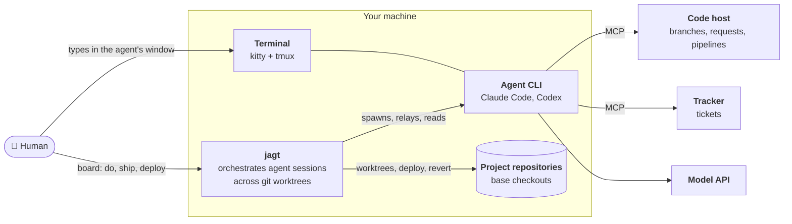
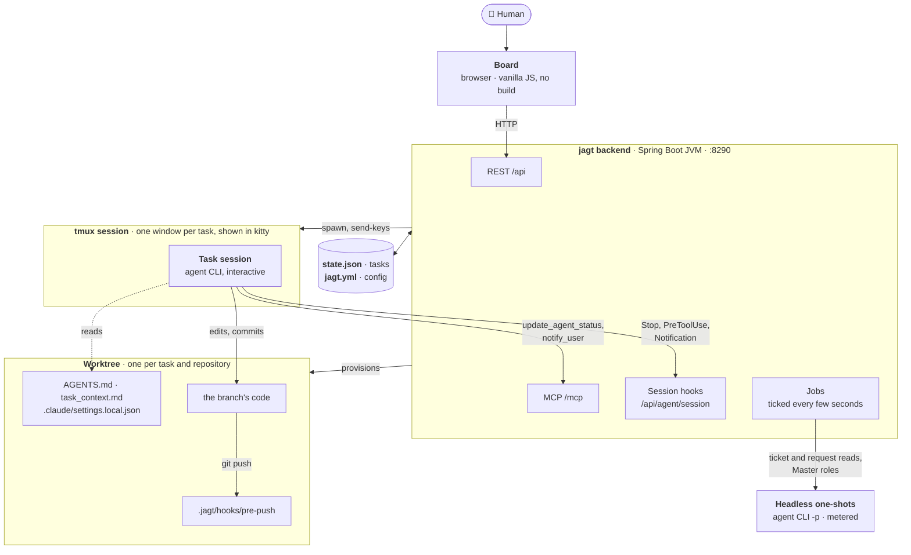
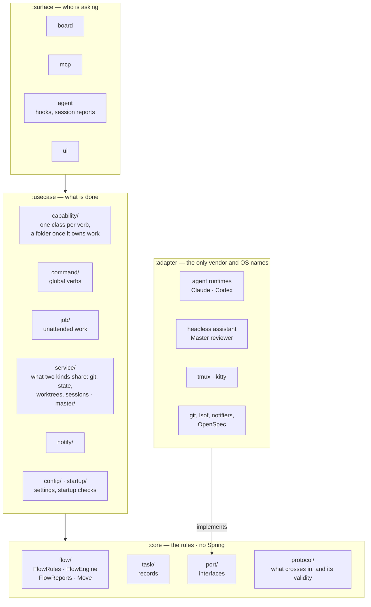
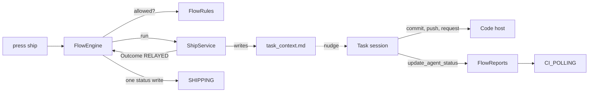
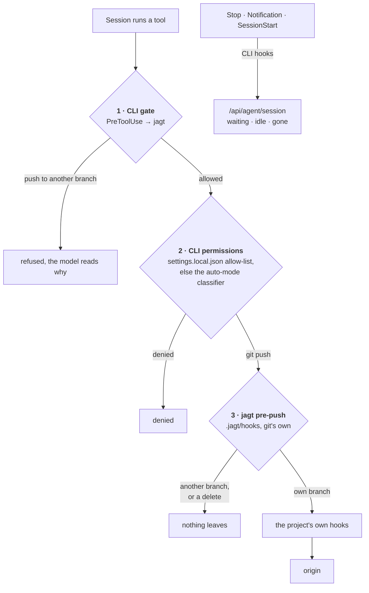
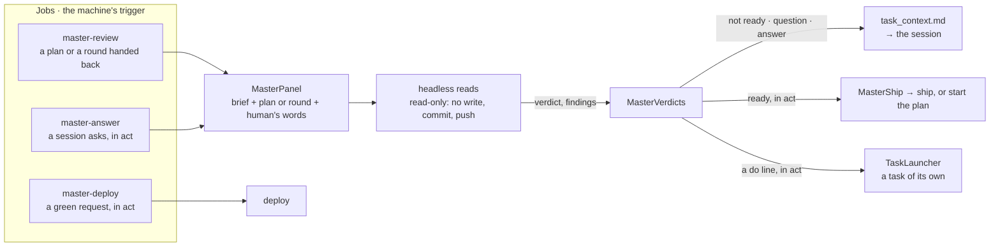

# jagt in C4

[`ARCHITECTURE.md`](../ARCHITECTURE.md) is the map of the code; these are the pictures of it, outermost first. Each
box is one thing a reader can find: a process, a file, a package.

## 1. Context — who jagt talks to

- jagt holds no credential: every read of the host or tracker is the agent CLI's own MCP
  ([0003](decisions/0003-tracker-and-code-host-are-read-through-the-agents-own-mcp.md)).
- git is the one external system jagt drives itself, and only `deploy` and `revert` write a shared branch.

## 2. Containers — what runs

| container | lives | decides |
|-----------|-------|---------|
| Board | a browser tab | nothing: it renders `TaskView` and posts a verb |
| jagt backend | one JVM | every status, through `FlowRules` |
| Task session | a tmux window | the code, and what it reports |
| Headless one-shot | a process per question | one answer: a ticket's facts, a verdict |
| Worktree | a directory beside the repository | nothing: it is what the session is given |

## 3. Components — the backend's rings

- Arrows point inward only; the modules make it the compiler's rule, `RingsTest` the rest.
- A status is written by two doors alone: `FlowEngine` for a verb, `FlowReports` for a session's report.

## 4. Code — one verb, end to end

## The hook layers

Three layers stand between a session and the outside, each refusing one thing.

- Layer 3 catches a CLI with no hooks of its own; nothing is ever written into the repository's `.git/hooks`.
- The allow-list is jagt's plus `agentAllowedTools`: a ship's request write is pre-approved, never guessed at.
- Event hooks only report; liveness is read from the CLI's own log, so a session out of tokens still reaches the board.

## The Master

An unattended reader in `judge`; in `act` it also stands where the human stands.

- The model judges, the machine moves: every press goes through `FlowRules` like yours
  ([0006](decisions/0006-the-machine-owns-every-move-a-model-only-judges.md)).
- `master.mine` keeps named steps human; the human's own words in the session overrule any decision
  ([0010](decisions/0010-the-humans-own-word-stands-over-the-master.md)).
