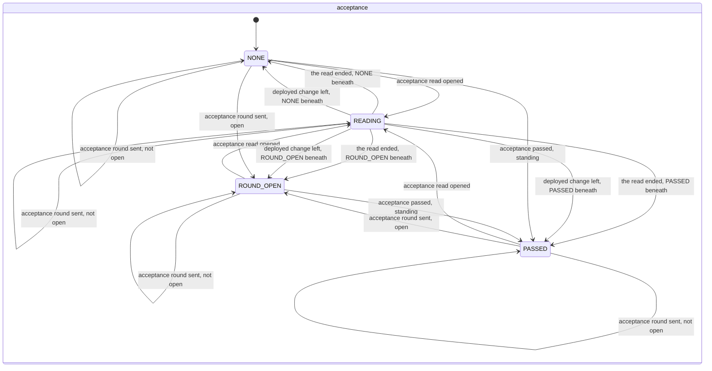

# The task acceptance chart

```mermaid
stateDiagram-v2
    state acceptance {
        state "NONE" as acceptance_NONE
        state "READING" as acceptance_READING
        state "ROUND_OPEN" as acceptance_ROUND_OPEN
        state "PASSED" as acceptance_PASSED
        [*] --> acceptance_NONE
        acceptance_NONE --> acceptance_READING : acceptance read opened
        acceptance_READING --> acceptance_READING : acceptance read opened
        acceptance_ROUND_OPEN --> acceptance_READING : acceptance read opened
        acceptance_PASSED --> acceptance_READING : acceptance read opened
        acceptance_READING --> acceptance_NONE : the read ended, NONE beneath
        acceptance_READING --> acceptance_NONE : deployed change left, NONE beneath
        acceptance_READING --> acceptance_ROUND_OPEN : the read ended, ROUND_OPEN beneath
        acceptance_READING --> acceptance_ROUND_OPEN : deployed change left, ROUND_OPEN beneath
        acceptance_READING --> acceptance_PASSED : the read ended, PASSED beneath
        acceptance_READING --> acceptance_PASSED : deployed change left, PASSED beneath
        acceptance_NONE --> acceptance_PASSED : acceptance passed, standing
        acceptance_NONE --> acceptance_NONE : acceptance passed, not standing
        acceptance_NONE --> acceptance_ROUND_OPEN : acceptance round sent, open
        acceptance_NONE --> acceptance_NONE : acceptance round sent, not open
        acceptance_READING --> acceptance_READING : acceptance passed, standing
        acceptance_READING --> acceptance_READING : acceptance passed, not standing
        acceptance_READING --> acceptance_READING : acceptance round sent, open
        acceptance_READING --> acceptance_READING : acceptance round sent, not open
        acceptance_ROUND_OPEN --> acceptance_PASSED : acceptance passed, standing
        acceptance_ROUND_OPEN --> acceptance_ROUND_OPEN : acceptance passed, not standing
        acceptance_ROUND_OPEN --> acceptance_ROUND_OPEN : acceptance round sent, open
        acceptance_ROUND_OPEN --> acceptance_ROUND_OPEN : acceptance round sent, not open
        acceptance_PASSED --> acceptance_PASSED : acceptance passed, standing
        acceptance_PASSED --> acceptance_PASSED : acceptance passed, not standing
        acceptance_PASSED --> acceptance_ROUND_OPEN : acceptance round sent, open
        acceptance_PASSED --> acceptance_PASSED : acceptance round sent, not open
    }
```
