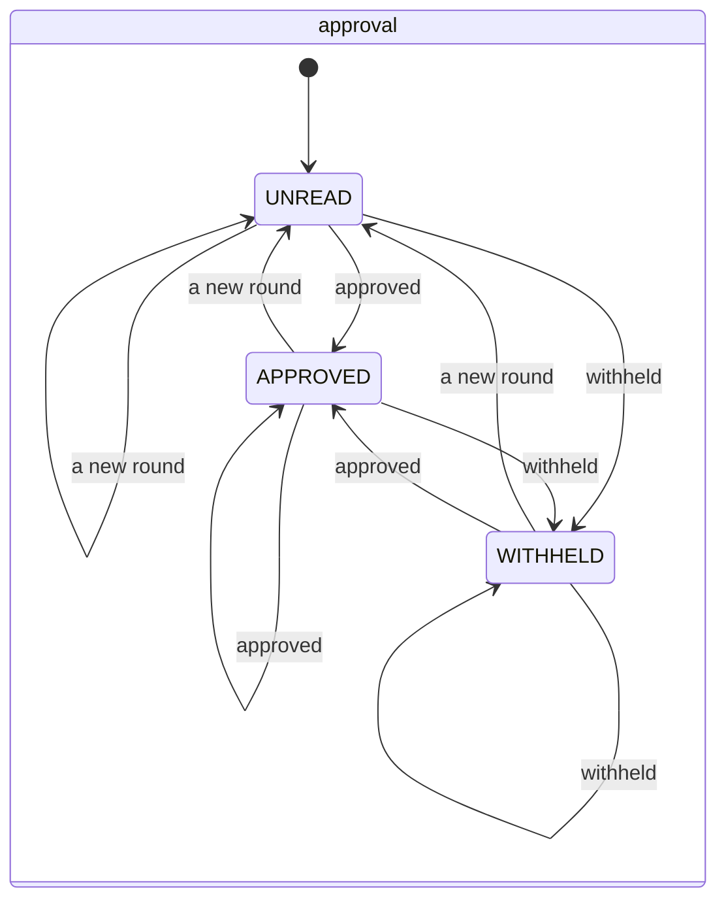

# The task approval chart

```mermaid
stateDiagram-v2
    state approval {
        state "UNREAD" as approval_UNREAD
        state "APPROVED" as approval_APPROVED
        state "WITHHELD" as approval_WITHHELD
        [*] --> approval_UNREAD
        approval_UNREAD --> approval_UNREAD : a new round
        approval_UNREAD --> approval_APPROVED : approved
        approval_UNREAD --> approval_WITHHELD : withheld
        approval_APPROVED --> approval_UNREAD : a new round
        approval_APPROVED --> approval_APPROVED : approved
        approval_APPROVED --> approval_WITHHELD : withheld
        approval_WITHHELD --> approval_UNREAD : a new round
        approval_WITHHELD --> approval_APPROVED : approved
        approval_WITHHELD --> approval_WITHHELD : withheld
    }
```
