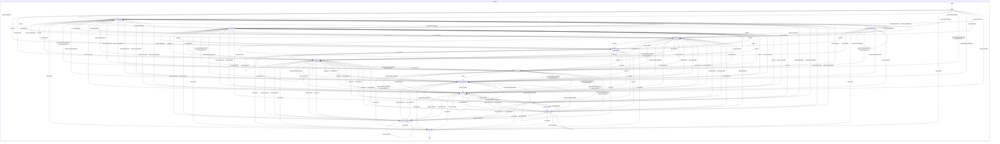

# The task lifecycle chart

```mermaid
stateDiagram-v2
    state lifecycle {
        state "NEW" as lifecycle_NEW
        state "PLAN_PENDING" as lifecycle_PLAN_PENDING
        state "IN_PROGRESS" as lifecycle_IN_PROGRESS
        state "VERIFYING" as lifecycle_VERIFYING
        state "REVIEW_PENDING" as lifecycle_REVIEW_PENDING
        state "SHIPPING" as lifecycle_SHIPPING
        state "CI_POLLING" as lifecycle_CI_POLLING
        state "CI_FAILED" as lifecycle_CI_FAILED
        state "REVIEWED" as lifecycle_REVIEWED
        state "APPROVED" as lifecycle_APPROVED
        state "DEPLOY_CONFLICT" as lifecycle_DEPLOY_CONFLICT
        state "DEPLOYED" as lifecycle_DEPLOYED
        state "REVERTED" as lifecycle_REVERTED
        state "DONE" as lifecycle_DONE
        [*] --> lifecycle_NEW
        lifecycle_IN_PROGRESS --> lifecycle_CI_POLLING : ship OK
        lifecycle_VERIFYING --> lifecycle_CI_POLLING : ship OK
        lifecycle_REVIEW_PENDING --> lifecycle_CI_POLLING : ship OK
        lifecycle_SHIPPING --> lifecycle_CI_POLLING : ship OK
        lifecycle_CI_POLLING --> lifecycle_CI_POLLING : ship OK
        lifecycle_CI_FAILED --> lifecycle_CI_POLLING : ship OK
        lifecycle_REVIEWED --> lifecycle_CI_POLLING : ship OK
        lifecycle_DEPLOYED --> lifecycle_CI_POLLING : ship OK
        lifecycle_REVERTED --> lifecycle_CI_POLLING : ship OK
        lifecycle_IN_PROGRESS --> lifecycle_SHIPPING : ship RELAYED
        lifecycle_VERIFYING --> lifecycle_SHIPPING : ship RELAYED
        lifecycle_REVIEW_PENDING --> lifecycle_SHIPPING : ship RELAYED
        lifecycle_SHIPPING --> lifecycle_SHIPPING : ship RELAYED
        lifecycle_CI_POLLING --> lifecycle_SHIPPING : ship RELAYED
        lifecycle_CI_FAILED --> lifecycle_SHIPPING : ship RELAYED
        lifecycle_REVIEWED --> lifecycle_SHIPPING : ship RELAYED
        lifecycle_DEPLOYED --> lifecycle_SHIPPING : ship RELAYED
        lifecycle_REVERTED --> lifecycle_SHIPPING : ship RELAYED
        lifecycle_PLAN_PENDING --> lifecycle_IN_PROGRESS : approve-plan RELAYED
        lifecycle_NEW --> lifecycle_IN_PROGRESS : add-repo RELAYED
        lifecycle_IN_PROGRESS --> lifecycle_IN_PROGRESS : add-repo RELAYED
        lifecycle_VERIFYING --> lifecycle_IN_PROGRESS : add-repo RELAYED
        lifecycle_REVIEW_PENDING --> lifecycle_IN_PROGRESS : add-repo RELAYED
        lifecycle_SHIPPING --> lifecycle_IN_PROGRESS : add-repo RELAYED
        lifecycle_CI_POLLING --> lifecycle_IN_PROGRESS : add-repo RELAYED
        lifecycle_CI_FAILED --> lifecycle_IN_PROGRESS : add-repo RELAYED
        lifecycle_REVIEWED --> lifecycle_IN_PROGRESS : add-repo RELAYED
        lifecycle_APPROVED --> lifecycle_IN_PROGRESS : add-repo RELAYED
        lifecycle_REVIEW_PENDING --> lifecycle_DEPLOYED : deploy OK
        lifecycle_CI_POLLING --> lifecycle_DEPLOYED : deploy OK
        lifecycle_CI_FAILED --> lifecycle_DEPLOYED : deploy OK
        lifecycle_REVIEWED --> lifecycle_DEPLOYED : deploy OK
        lifecycle_APPROVED --> lifecycle_DEPLOYED : deploy OK
        lifecycle_DEPLOY_CONFLICT --> lifecycle_DEPLOYED : deploy OK
        lifecycle_DEPLOYED --> lifecycle_DEPLOYED : deploy OK
        lifecycle_REVIEW_PENDING --> lifecycle_DEPLOY_CONFLICT : deploy CONFLICT
        lifecycle_CI_POLLING --> lifecycle_DEPLOY_CONFLICT : deploy CONFLICT
        lifecycle_CI_FAILED --> lifecycle_DEPLOY_CONFLICT : deploy CONFLICT
        lifecycle_REVIEWED --> lifecycle_DEPLOY_CONFLICT : deploy CONFLICT
        lifecycle_APPROVED --> lifecycle_DEPLOY_CONFLICT : deploy CONFLICT
        lifecycle_DEPLOY_CONFLICT --> lifecycle_DEPLOY_CONFLICT : deploy CONFLICT
        lifecycle_DEPLOYED --> lifecycle_DEPLOY_CONFLICT : deploy CONFLICT
        lifecycle_NEW --> lifecycle_REVERTED : revert OK
        lifecycle_PLAN_PENDING --> lifecycle_REVERTED : revert OK
        lifecycle_IN_PROGRESS --> lifecycle_REVERTED : revert OK
        lifecycle_VERIFYING --> lifecycle_REVERTED : revert OK
        lifecycle_REVIEW_PENDING --> lifecycle_REVERTED : revert OK
        lifecycle_SHIPPING --> lifecycle_REVERTED : revert OK
        lifecycle_CI_POLLING --> lifecycle_REVERTED : revert OK
        lifecycle_CI_FAILED --> lifecycle_REVERTED : revert OK
        lifecycle_REVIEWED --> lifecycle_REVERTED : revert OK
        lifecycle_APPROVED --> lifecycle_REVERTED : revert OK
        lifecycle_DEPLOY_CONFLICT --> lifecycle_REVERTED : revert OK
        lifecycle_DEPLOYED --> lifecycle_REVERTED : revert OK
        lifecycle_REVERTED --> lifecycle_REVERTED : revert OK
        lifecycle_REVIEW_PENDING --> lifecycle_DEPLOY_CONFLICT : revert CONFLICT
        lifecycle_CI_POLLING --> lifecycle_DEPLOY_CONFLICT : revert CONFLICT
        lifecycle_CI_FAILED --> lifecycle_DEPLOY_CONFLICT : revert CONFLICT
        lifecycle_REVIEWED --> lifecycle_DEPLOY_CONFLICT : revert CONFLICT
        lifecycle_APPROVED --> lifecycle_DEPLOY_CONFLICT : revert CONFLICT
        lifecycle_DEPLOY_CONFLICT --> lifecycle_DEPLOY_CONFLICT : revert CONFLICT
        lifecycle_DEPLOYED --> lifecycle_DEPLOY_CONFLICT : revert CONFLICT
        lifecycle_NEW --> lifecycle_DEPLOYED : revert PARTIAL
        lifecycle_PLAN_PENDING --> lifecycle_DEPLOYED : revert PARTIAL
        lifecycle_IN_PROGRESS --> lifecycle_DEPLOYED : revert PARTIAL
        lifecycle_VERIFYING --> lifecycle_DEPLOYED : revert PARTIAL
        lifecycle_REVIEW_PENDING --> lifecycle_DEPLOYED : revert PARTIAL
        lifecycle_SHIPPING --> lifecycle_DEPLOYED : revert PARTIAL
        lifecycle_CI_POLLING --> lifecycle_DEPLOYED : revert PARTIAL
        lifecycle_CI_FAILED --> lifecycle_DEPLOYED : revert PARTIAL
        lifecycle_REVIEWED --> lifecycle_DEPLOYED : revert PARTIAL
        lifecycle_APPROVED --> lifecycle_DEPLOYED : revert PARTIAL
        lifecycle_DEPLOYED --> lifecycle_DEPLOYED : revert PARTIAL
        lifecycle_REVERTED --> lifecycle_DEPLOYED : revert PARTIAL
        lifecycle_NEW --> lifecycle_DONE : done GONE
        lifecycle_PLAN_PENDING --> lifecycle_DONE : done GONE
        lifecycle_IN_PROGRESS --> lifecycle_DONE : done GONE
        lifecycle_VERIFYING --> lifecycle_DONE : done GONE
        lifecycle_REVIEW_PENDING --> lifecycle_DONE : done GONE
        lifecycle_SHIPPING --> lifecycle_DONE : done GONE
        lifecycle_CI_POLLING --> lifecycle_DONE : done GONE
        lifecycle_CI_FAILED --> lifecycle_DONE : done GONE
        lifecycle_REVIEWED --> lifecycle_DONE : done GONE
        lifecycle_APPROVED --> lifecycle_DONE : done GONE
        lifecycle_DEPLOY_CONFLICT --> lifecycle_DONE : done GONE
        lifecycle_DEPLOYED --> lifecycle_DONE : done GONE
        lifecycle_REVERTED --> lifecycle_DONE : done GONE
        lifecycle_NEW --> lifecycle_PLAN_PENDING : report PLAN_PENDING
        lifecycle_PLAN_PENDING --> lifecycle_PLAN_PENDING : report PLAN_PENDING
        lifecycle_IN_PROGRESS --> lifecycle_PLAN_PENDING : report PLAN_PENDING
        lifecycle_NEW --> lifecycle_IN_PROGRESS : report IN_PROGRESS
        lifecycle_PLAN_PENDING --> lifecycle_IN_PROGRESS : report IN_PROGRESS
        lifecycle_IN_PROGRESS --> lifecycle_IN_PROGRESS : report IN_PROGRESS
        lifecycle_VERIFYING --> lifecycle_IN_PROGRESS : report IN_PROGRESS
        lifecycle_REVIEW_PENDING --> lifecycle_IN_PROGRESS : report IN_PROGRESS
        lifecycle_SHIPPING --> lifecycle_IN_PROGRESS : report IN_PROGRESS
        lifecycle_CI_POLLING --> lifecycle_IN_PROGRESS : report IN_PROGRESS
        lifecycle_CI_FAILED --> lifecycle_IN_PROGRESS : report IN_PROGRESS
        lifecycle_REVIEWED --> lifecycle_IN_PROGRESS : report IN_PROGRESS
        lifecycle_APPROVED --> lifecycle_IN_PROGRESS : report IN_PROGRESS
        lifecycle_DEPLOY_CONFLICT --> lifecycle_DEPLOY_CONFLICT : report IN_PROGRESS
        lifecycle_DEPLOYED --> lifecycle_IN_PROGRESS : report IN_PROGRESS
        lifecycle_REVERTED --> lifecycle_REVERTED : report IN_PROGRESS
        lifecycle_NEW --> lifecycle_VERIFYING : report REVIEW_PENDING owing verification
        lifecycle_NEW --> lifecycle_REVIEW_PENDING : report REVIEW_PENDING
        lifecycle_PLAN_PENDING --> lifecycle_VERIFYING : report REVIEW_PENDING owing verification
        lifecycle_PLAN_PENDING --> lifecycle_REVIEW_PENDING : report REVIEW_PENDING
        lifecycle_IN_PROGRESS --> lifecycle_VERIFYING : report REVIEW_PENDING owing verification
        lifecycle_IN_PROGRESS --> lifecycle_REVIEW_PENDING : report REVIEW_PENDING
        lifecycle_VERIFYING --> lifecycle_VERIFYING : report REVIEW_PENDING owing verification
        lifecycle_VERIFYING --> lifecycle_REVIEW_PENDING : report REVIEW_PENDING
        lifecycle_REVIEW_PENDING --> lifecycle_VERIFYING : report REVIEW_PENDING owing verification
        lifecycle_REVIEW_PENDING --> lifecycle_REVIEW_PENDING : report REVIEW_PENDING
        lifecycle_SHIPPING --> lifecycle_VERIFYING : report REVIEW_PENDING owing verification
        lifecycle_SHIPPING --> lifecycle_REVIEW_PENDING : report REVIEW_PENDING
        lifecycle_CI_POLLING --> lifecycle_VERIFYING : report REVIEW_PENDING owing verification
        lifecycle_CI_POLLING --> lifecycle_REVIEW_PENDING : report REVIEW_PENDING
        lifecycle_CI_FAILED --> lifecycle_VERIFYING : report REVIEW_PENDING owing verification
        lifecycle_CI_FAILED --> lifecycle_REVIEW_PENDING : report REVIEW_PENDING
        lifecycle_REVIEWED --> lifecycle_VERIFYING : report REVIEW_PENDING owing verification
        lifecycle_REVIEWED --> lifecycle_REVIEW_PENDING : report REVIEW_PENDING
        lifecycle_APPROVED --> lifecycle_VERIFYING : report REVIEW_PENDING owing verification
        lifecycle_APPROVED --> lifecycle_REVIEW_PENDING : report REVIEW_PENDING
        lifecycle_DEPLOY_CONFLICT --> lifecycle_DEPLOY_CONFLICT : report REVIEW_PENDING
        lifecycle_DEPLOYED --> lifecycle_VERIFYING : report REVIEW_PENDING owing verification
        lifecycle_DEPLOYED --> lifecycle_REVIEW_PENDING : report REVIEW_PENDING
        lifecycle_REVERTED --> lifecycle_REVERTED : report REVIEW_PENDING
        lifecycle_NEW --> lifecycle_SHIPPING : report SHIPPING
        lifecycle_PLAN_PENDING --> lifecycle_SHIPPING : report SHIPPING
        lifecycle_IN_PROGRESS --> lifecycle_SHIPPING : report SHIPPING
        lifecycle_VERIFYING --> lifecycle_SHIPPING : report SHIPPING
        lifecycle_REVIEW_PENDING --> lifecycle_SHIPPING : report SHIPPING
        lifecycle_SHIPPING --> lifecycle_SHIPPING : report SHIPPING
        lifecycle_CI_POLLING --> lifecycle_SHIPPING : report SHIPPING
        lifecycle_CI_FAILED --> lifecycle_SHIPPING : report SHIPPING
        lifecycle_REVIEWED --> lifecycle_SHIPPING : report SHIPPING
        lifecycle_APPROVED --> lifecycle_SHIPPING : report SHIPPING
        lifecycle_DEPLOY_CONFLICT --> lifecycle_DEPLOY_CONFLICT : report SHIPPING
        lifecycle_DEPLOYED --> lifecycle_SHIPPING : report SHIPPING
        lifecycle_REVERTED --> lifecycle_REVERTED : report SHIPPING
        lifecycle_NEW --> lifecycle_CI_POLLING : report CI_POLLING
        lifecycle_IN_PROGRESS --> lifecycle_CI_POLLING : report CI_POLLING
        lifecycle_REVIEW_PENDING --> lifecycle_CI_POLLING : report CI_POLLING
        lifecycle_SHIPPING --> lifecycle_CI_POLLING : report CI_POLLING
        lifecycle_CI_POLLING --> lifecycle_CI_POLLING : report CI_POLLING
        lifecycle_CI_FAILED --> lifecycle_CI_POLLING : report CI_POLLING
        lifecycle_NEW --> lifecycle_CI_FAILED : report CI_FAILED
        lifecycle_PLAN_PENDING --> lifecycle_CI_FAILED : report CI_FAILED
        lifecycle_IN_PROGRESS --> lifecycle_CI_FAILED : report CI_FAILED
        lifecycle_VERIFYING --> lifecycle_CI_FAILED : report CI_FAILED
        lifecycle_REVIEW_PENDING --> lifecycle_CI_FAILED : report CI_FAILED
        lifecycle_SHIPPING --> lifecycle_CI_FAILED : report CI_FAILED
        lifecycle_CI_POLLING --> lifecycle_CI_FAILED : report CI_FAILED
        lifecycle_CI_FAILED --> lifecycle_CI_FAILED : report CI_FAILED
        lifecycle_REVIEWED --> lifecycle_CI_FAILED : report CI_FAILED
        lifecycle_APPROVED --> lifecycle_CI_FAILED : report CI_FAILED
        lifecycle_DEPLOY_CONFLICT --> lifecycle_DEPLOY_CONFLICT : report CI_FAILED
        lifecycle_DEPLOYED --> lifecycle_CI_FAILED : report CI_FAILED
        lifecycle_REVERTED --> lifecycle_REVERTED : report CI_FAILED
        lifecycle_CI_POLLING --> lifecycle_CI_FAILED : read CI_FAILED
        lifecycle_CI_FAILED --> lifecycle_CI_FAILED : read CI_FAILED
        lifecycle_REVIEWED --> lifecycle_CI_FAILED : read CI_FAILED
        lifecycle_APPROVED --> lifecycle_CI_FAILED : read CI_FAILED
        lifecycle_CI_POLLING --> lifecycle_REVIEWED : read REVIEWED
        lifecycle_CI_FAILED --> lifecycle_REVIEWED : read REVIEWED
        lifecycle_REVIEWED --> lifecycle_REVIEWED : read REVIEWED
        lifecycle_APPROVED --> lifecycle_REVIEWED : read REVIEWED
        lifecycle_CI_POLLING --> lifecycle_APPROVED : read APPROVED
        lifecycle_CI_FAILED --> lifecycle_APPROVED : read APPROVED
        lifecycle_REVIEWED --> lifecycle_APPROVED : read APPROVED
        lifecycle_APPROVED --> lifecycle_APPROVED : read APPROVED
        lifecycle_DEPLOYED --> lifecycle_DEPLOY_CONFLICT : deploy read red
        lifecycle_VERIFYING --> lifecycle_REVIEW_PENDING : verified
        lifecycle_VERIFYING --> lifecycle_IN_PROGRESS : verification failed
        lifecycle_DONE --> [*]
    }
```
