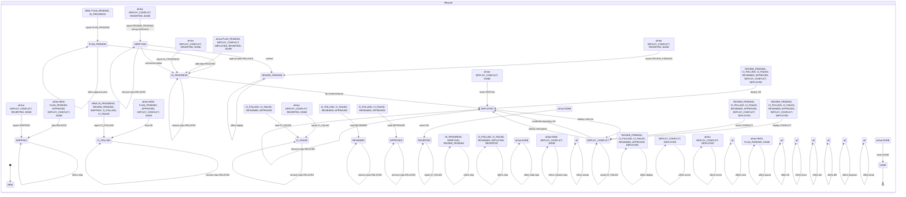

# The task lifecycle chart

```mermaid
stateDiagram-v2
    state lifecycle {
        state "NEW" as lifecycle_NEW
        state "PLAN_PENDING" as lifecycle_PLAN_PENDING
        state "IN_PROGRESS" as lifecycle_IN_PROGRESS
        state "VERIFYING" as lifecycle_VERIFYING
        state "REVIEW_PENDING" as lifecycle_REVIEW_PENDING
        state "SHIPPING" as lifecycle_SHIPPING
        state "CI_POLLING" as lifecycle_CI_POLLING
        state "CI_FAILED" as lifecycle_CI_FAILED
        state "REVIEWED" as lifecycle_REVIEWED
        state "APPROVED" as lifecycle_APPROVED
        state "DEPLOY_CONFLICT" as lifecycle_DEPLOY_CONFLICT
        state "DEPLOYED" as lifecycle_DEPLOYED
        state "REVERTED" as lifecycle_REVERTED
        state "DONE" as lifecycle_DONE
        [*] --> lifecycle_NEW
        state "all but NEW, PLAN_PENDING, APPROVED, DEPLOY_CONFLICT, DONE" as lifecycle_from_1
        lifecycle_from_1 --> lifecycle_CI_POLLING : ship OK
        state "all but NEW, PLAN_PENDING, APPROVED, DEPLOY_CONFLICT, DONE" as lifecycle_from_2
        lifecycle_from_2 --> lifecycle_SHIPPING : ship RELAYED
        lifecycle_PLAN_PENDING --> lifecycle_IN_PROGRESS : approve-plan RELAYED
        state "all but PLAN_PENDING, DEPLOY_CONFLICT, DEPLOYED, REVERTED, DONE" as lifecycle_from_4
        lifecycle_from_4 --> lifecycle_IN_PROGRESS : add-repo RELAYED
        lifecycle_PLAN_PENDING --> lifecycle_PLAN_PENDING : remove-repo RELAYED
        lifecycle_IN_PROGRESS --> lifecycle_IN_PROGRESS : remove-repo RELAYED
        lifecycle_VERIFYING --> lifecycle_VERIFYING : remove-repo RELAYED
        lifecycle_REVIEW_PENDING --> lifecycle_REVIEW_PENDING : remove-repo RELAYED
        lifecycle_SHIPPING --> lifecycle_SHIPPING : remove-repo RELAYED
        lifecycle_CI_POLLING --> lifecycle_CI_POLLING : remove-repo RELAYED
        lifecycle_CI_FAILED --> lifecycle_CI_FAILED : remove-repo RELAYED
        lifecycle_REVIEWED --> lifecycle_REVIEWED : remove-repo RELAYED
        lifecycle_APPROVED --> lifecycle_APPROVED : remove-repo RELAYED
        lifecycle_DEPLOYED --> lifecycle_DEPLOYED : remove-repo RELAYED
        lifecycle_REVERTED --> lifecycle_REVERTED : remove-repo RELAYED
        state "REVIEW_PENDING, CI_POLLING, CI_FAILED, REVIEWED, APPROVED, DEPLOY_CONFLICT, DEPLOYED" as lifecycle_from_5
        lifecycle_from_5 --> lifecycle_DEPLOYED : deploy OK
        state "REVIEW_PENDING, CI_POLLING, CI_FAILED, REVIEWED, APPROVED, DEPLOY_CONFLICT, DEPLOYED" as lifecycle_from_6
        lifecycle_from_6 --> lifecycle_DEPLOY_CONFLICT : deploy CONFLICT
        state "all but DONE" as lifecycle_from_7
        lifecycle_from_7 --> lifecycle_REVERTED : revert OK
        state "REVIEW_PENDING, CI_POLLING, CI_FAILED, REVIEWED, APPROVED, DEPLOY_CONFLICT, DEPLOYED" as lifecycle_from_8
        lifecycle_from_8 --> lifecycle_DEPLOY_CONFLICT : revert CONFLICT
        state "all but DEPLOY_CONFLICT, DONE" as lifecycle_from_9
        lifecycle_from_9 --> lifecycle_DEPLOYED : revert PARTIAL
        state "all but DONE" as lifecycle_from_10
        lifecycle_from_10 --> lifecycle_DONE : done GONE
        state "IN_PROGRESS, VERIFYING, REVIEW_PENDING" as lifecycle_from_11
        lifecycle_from_11 --> lifecycle_from_11 : offers ship
        lifecycle_SHIPPING --> lifecycle_SHIPPING : offers ship
        state "CI_POLLING, CI_FAILED, REVIEWED, DEPLOYED, REVERTED" as lifecycle_from_13
        lifecycle_from_13 --> lifecycle_from_13 : offers ship
        lifecycle_PLAN_PENDING --> lifecycle_PLAN_PENDING : offers approve-plan
        state "all but DONE" as lifecycle_from_15
        lifecycle_from_15 --> lifecycle_from_15 : offers add-repo
        state "all but NEW, DEPLOY_CONFLICT, DONE" as lifecycle_from_16
        lifecycle_from_16 --> lifecycle_from_16 : offers remove-repo
        state "all" as lifecycle_from_17
        lifecycle_from_17 --> lifecycle_from_17 : offers sweep
        lifecycle_DEPLOY_CONFLICT --> lifecycle_DEPLOY_CONFLICT : offers deploy
        state "REVIEW_PENDING, CI_POLLING, CI_FAILED, REVIEWED, APPROVED, DEPLOYED" as lifecycle_from_19
        lifecycle_from_19 --> lifecycle_from_19 : offers deploy
        lifecycle_REVIEW_PENDING --> lifecycle_REVIEW_PENDING : offers deploy
        state "DEPLOY_CONFLICT, DEPLOYED" as lifecycle_from_21
        lifecycle_from_21 --> lifecycle_from_21 : offers revert
        state "all but DEPLOY_CONFLICT, DEPLOYED" as lifecycle_from_22
        lifecycle_from_22 --> lifecycle_from_22 : offers revert
        state "all" as lifecycle_from_23
        lifecycle_from_23 --> lifecycle_from_23 : offers trust
        state "all but NEW, PLAN_PENDING, DONE" as lifecycle_from_24
        lifecycle_from_24 --> lifecycle_from_24 : offers pause
        state "all" as lifecycle_from_25
        lifecycle_from_25 --> lifecycle_from_25 : offers lift
        state "all" as lifecycle_from_26
        lifecycle_from_26 --> lifecycle_from_26 : offers focus
        state "all" as lifecycle_from_27
        lifecycle_from_27 --> lifecycle_from_27 : offers ide
        state "all" as lifecycle_from_28
        lifecycle_from_28 --> lifecycle_from_28 : offers diff
        state "all" as lifecycle_from_29
        lifecycle_from_29 --> lifecycle_from_29 : offers respawn
        state "all" as lifecycle_from_30
        lifecycle_from_30 --> lifecycle_from_30 : offers done
        state "NEW, PLAN_PENDING, IN_PROGRESS" as lifecycle_from_31
        lifecycle_from_31 --> lifecycle_PLAN_PENDING : report PLAN_PENDING
        state "all but DEPLOY_CONFLICT, REVERTED, DONE" as lifecycle_from_32
        lifecycle_from_32 --> lifecycle_IN_PROGRESS : report IN_PROGRESS
        lifecycle_DEPLOY_CONFLICT --> lifecycle_DEPLOY_CONFLICT : report IN_PROGRESS
        lifecycle_REVERTED --> lifecycle_REVERTED : report IN_PROGRESS
        state "all but DEPLOY_CONFLICT, REVERTED, DONE" as lifecycle_from_33
        lifecycle_from_33 --> lifecycle_VERIFYING : report REVIEW_PENDING owing verification
        state "all but DEPLOY_CONFLICT, REVERTED, DONE" as lifecycle_from_34
        lifecycle_from_34 --> lifecycle_REVIEW_PENDING : report REVIEW_PENDING
        lifecycle_DEPLOY_CONFLICT --> lifecycle_DEPLOY_CONFLICT : report REVIEW_PENDING
        lifecycle_REVERTED --> lifecycle_REVERTED : report REVIEW_PENDING
        state "all but DEPLOY_CONFLICT, REVERTED, DONE" as lifecycle_from_35
        lifecycle_from_35 --> lifecycle_SHIPPING : report SHIPPING
        lifecycle_DEPLOY_CONFLICT --> lifecycle_DEPLOY_CONFLICT : report SHIPPING
        lifecycle_REVERTED --> lifecycle_REVERTED : report SHIPPING
        state "NEW, IN_PROGRESS, REVIEW_PENDING, SHIPPING, CI_POLLING, CI_FAILED" as lifecycle_from_36
        lifecycle_from_36 --> lifecycle_CI_POLLING : report CI_POLLING
        state "all but DEPLOY_CONFLICT, REVERTED, DONE" as lifecycle_from_37
        lifecycle_from_37 --> lifecycle_CI_FAILED : report CI_FAILED
        lifecycle_DEPLOY_CONFLICT --> lifecycle_DEPLOY_CONFLICT : report CI_FAILED
        lifecycle_REVERTED --> lifecycle_REVERTED : report CI_FAILED
        state "CI_POLLING, CI_FAILED, REVIEWED, APPROVED" as lifecycle_from_38
        lifecycle_from_38 --> lifecycle_CI_FAILED : read CI_FAILED
        state "CI_POLLING, CI_FAILED, REVIEWED, APPROVED" as lifecycle_from_39
        lifecycle_from_39 --> lifecycle_REVIEWED : read REVIEWED
        state "CI_POLLING, CI_FAILED, REVIEWED, APPROVED" as lifecycle_from_40
        lifecycle_from_40 --> lifecycle_APPROVED : read APPROVED
        lifecycle_DEPLOY_CONFLICT --> lifecycle_DEPLOYED : conflicted repository left
        lifecycle_DEPLOYED --> lifecycle_DEPLOY_CONFLICT : deploy read red
        lifecycle_DEPLOY_CONFLICT --> lifecycle_DEPLOYED : deploy read green
        lifecycle_IN_PROGRESS --> lifecycle_DEPLOYED : qa round declined
        lifecycle_VERIFYING --> lifecycle_REVIEW_PENDING : verified
        lifecycle_VERIFYING --> lifecycle_IN_PROGRESS : verification failed
        lifecycle_DONE --> [*]
    }
```
