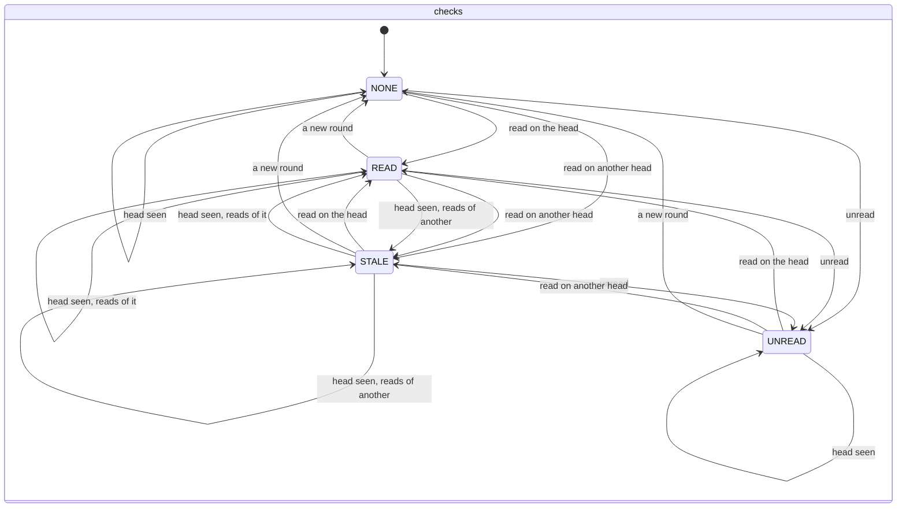

# The task checks chart

```mermaid
stateDiagram-v2
    state checks {
        state "NONE" as checks_NONE
        state "READ" as checks_READ
        state "STALE" as checks_STALE
        state "UNREAD" as checks_UNREAD
        [*] --> checks_NONE
        checks_NONE --> checks_READ : read on the head
        checks_NONE --> checks_STALE : read on another head
        checks_NONE --> checks_UNREAD : unread
        checks_READ --> checks_READ : read on the head
        checks_READ --> checks_STALE : read on another head
        checks_READ --> checks_UNREAD : unread
        checks_STALE --> checks_READ : read on the head
        checks_STALE --> checks_STALE : read on another head
        checks_STALE --> checks_UNREAD : unread
        checks_UNREAD --> checks_READ : read on the head
        checks_UNREAD --> checks_STALE : read on another head
        checks_UNREAD --> checks_UNREAD : unread
        checks_NONE --> checks_NONE : a new round
        checks_READ --> checks_NONE : a new round
        checks_STALE --> checks_NONE : a new round
        checks_UNREAD --> checks_NONE : a new round
        checks_NONE --> checks_NONE : head seen
        checks_UNREAD --> checks_UNREAD : head seen
        checks_READ --> checks_STALE : head seen, reads of another
        checks_READ --> checks_READ : head seen, reads of it
        checks_STALE --> checks_STALE : head seen, reads of another
        checks_STALE --> checks_READ : head seen, reads of it
    }
```
