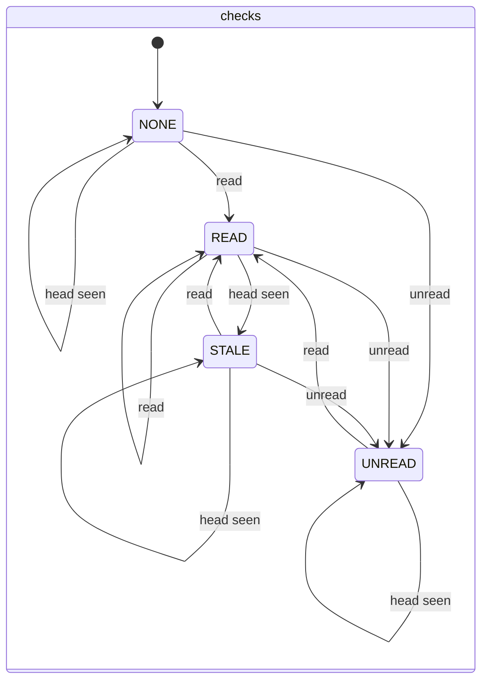

# The task checks chart

```mermaid
stateDiagram-v2
    state checks {
        state "NONE" as checks_NONE
        state "READ" as checks_READ
        state "STALE" as checks_STALE
        state "UNREAD" as checks_UNREAD
        [*] --> checks_NONE
        checks_NONE --> checks_READ : read
        checks_NONE --> checks_UNREAD : unread
        checks_NONE --> checks_NONE : head seen
        checks_READ --> checks_READ : read
        checks_READ --> checks_UNREAD : unread
        checks_READ --> checks_STALE : head seen
        checks_STALE --> checks_READ : read
        checks_STALE --> checks_UNREAD : unread
        checks_STALE --> checks_STALE : head seen
        checks_UNREAD --> checks_READ : read
        checks_UNREAD --> checks_UNREAD : unread
        checks_UNREAD --> checks_UNREAD : head seen
    }
```
