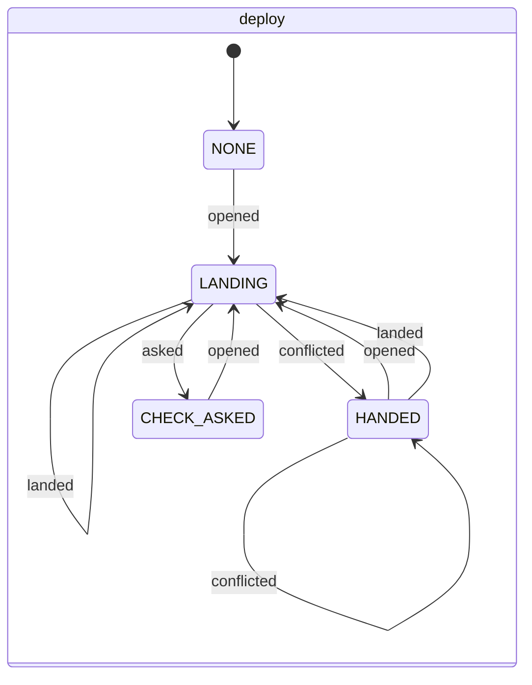

# The task deploy chart

```mermaid
stateDiagram-v2
    state deploy {
        state "NONE" as deploy_NONE
        state "LANDING" as deploy_LANDING
        state "HANDED" as deploy_HANDED
        state "CHECK_ASKED" as deploy_CHECK_ASKED
        [*] --> deploy_NONE
        deploy_NONE --> deploy_LANDING : opened
        deploy_LANDING --> deploy_LANDING : opened
        deploy_HANDED --> deploy_LANDING : opened
        deploy_CHECK_ASKED --> deploy_LANDING : opened
        deploy_LANDING --> deploy_LANDING : landed
        deploy_LANDING --> deploy_HANDED : conflicted
        deploy_HANDED --> deploy_LANDING : landed
        deploy_HANDED --> deploy_HANDED : conflicted
        deploy_LANDING --> deploy_CHECK_ASKED : asked
    }
```
