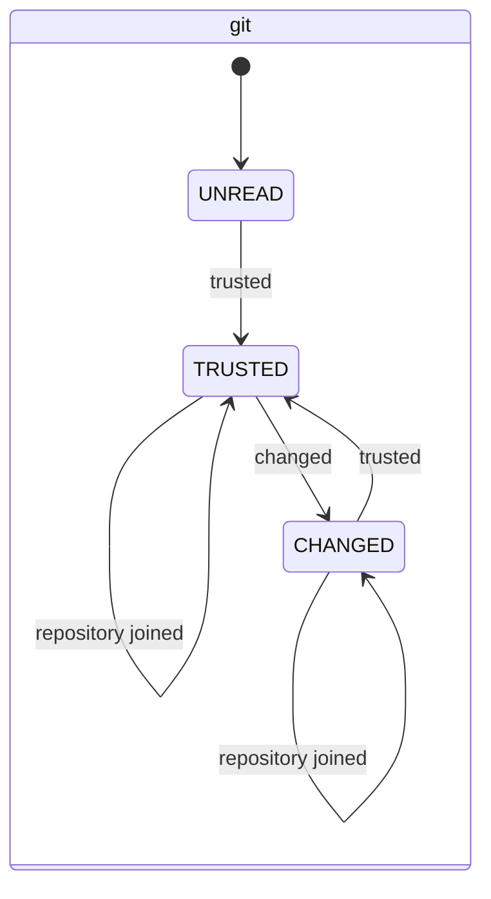

# The task git chart

```mermaid
stateDiagram-v2
    state git {
        state "UNREAD" as git_UNREAD
        state "TRUSTED" as git_TRUSTED
        state "CHANGED" as git_CHANGED
        [*] --> git_UNREAD
        git_UNREAD --> git_TRUSTED : trusted
        git_TRUSTED --> git_TRUSTED : trusted
        git_CHANGED --> git_TRUSTED : trusted
        git_TRUSTED --> git_CHANGED : changed
        git_TRUSTED --> git_TRUSTED : repository joined
        git_CHANGED --> git_CHANGED : repository joined
    }
```
