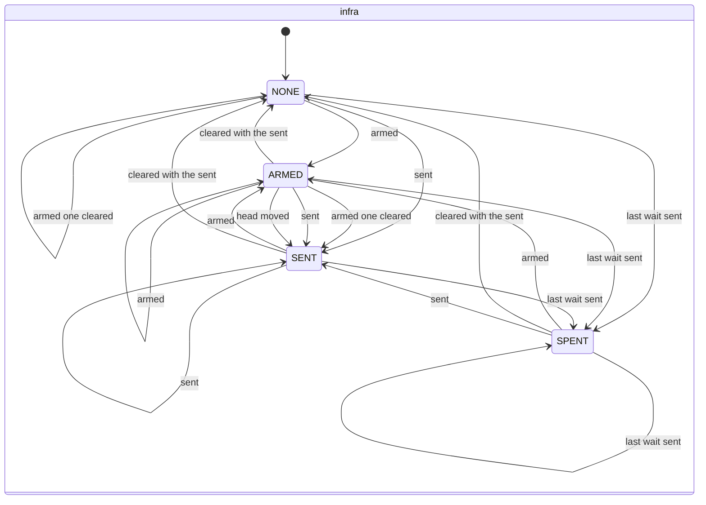

# The task infra chart

```mermaid
stateDiagram-v2
    state infra {
        state "NONE" as infra_NONE
        state "ARMED" as infra_ARMED
        state "SENT" as infra_SENT
        state "SPENT" as infra_SPENT
        [*] --> infra_NONE
        infra_NONE --> infra_ARMED : armed
        infra_NONE --> infra_NONE : cleared with the sent
        infra_NONE --> infra_NONE : armed one cleared
        infra_NONE --> infra_SENT : sent
        infra_NONE --> infra_SPENT : last wait sent
        infra_ARMED --> infra_ARMED : armed
        infra_ARMED --> infra_NONE : cleared with the sent
        infra_ARMED --> infra_SENT : armed one cleared
        infra_ARMED --> infra_SENT : sent
        infra_ARMED --> infra_SPENT : last wait sent
        infra_SENT --> infra_ARMED : armed
        infra_SENT --> infra_NONE : cleared with the sent
        infra_SENT --> infra_SENT : armed one cleared
        infra_SENT --> infra_SENT : sent
        infra_SENT --> infra_SPENT : last wait sent
        infra_SPENT --> infra_ARMED : armed
        infra_SPENT --> infra_NONE : cleared with the sent
        infra_SPENT --> infra_SPENT : armed one cleared
        infra_SPENT --> infra_SENT : sent
        infra_SPENT --> infra_SPENT : last wait sent
        infra_ARMED --> infra_SENT : head moved
    }
```
