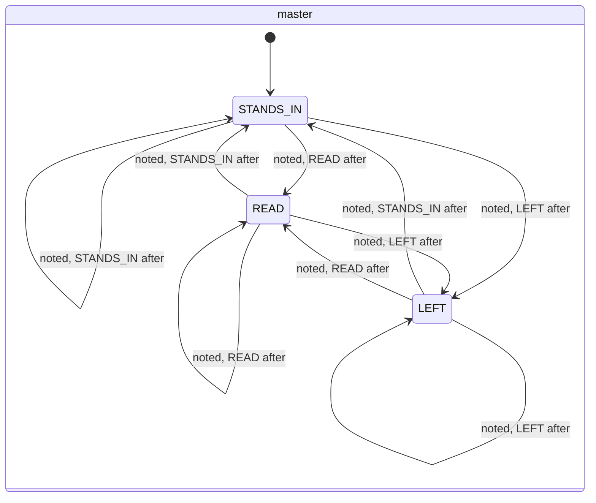

# The task master chart

```mermaid
stateDiagram-v2
    state master {
        state "STANDS_IN" as master_STANDS_IN
        state "READ" as master_READ
        state "LEFT" as master_LEFT
        [*] --> master_STANDS_IN
        master_STANDS_IN --> master_STANDS_IN : noted, STANDS_IN after
        master_STANDS_IN --> master_READ : noted, READ after
        master_STANDS_IN --> master_LEFT : noted, LEFT after
        master_READ --> master_STANDS_IN : noted, STANDS_IN after
        master_READ --> master_READ : noted, READ after
        master_READ --> master_LEFT : noted, LEFT after
        master_LEFT --> master_STANDS_IN : noted, STANDS_IN after
        master_LEFT --> master_READ : noted, READ after
        master_LEFT --> master_LEFT : noted, LEFT after
    }
```
