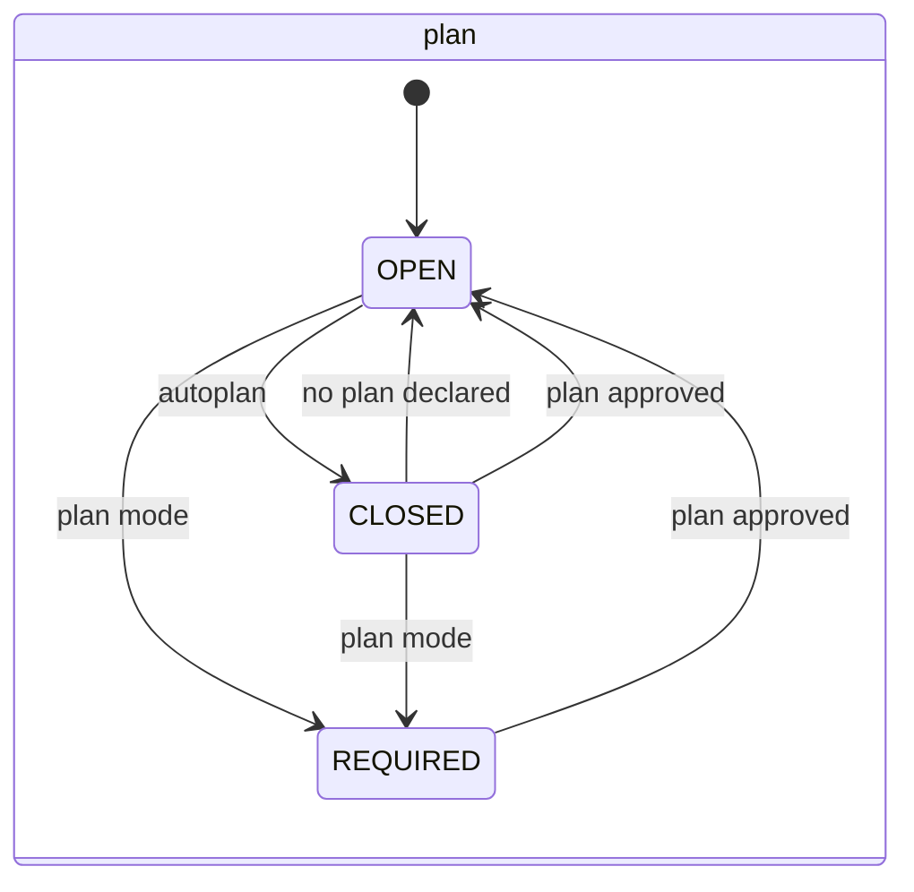

# The task plan chart

```mermaid
stateDiagram-v2
    state plan {
        state "OPEN" as plan_OPEN
        state "CLOSED" as plan_CLOSED
        state "REQUIRED" as plan_REQUIRED
        [*] --> plan_OPEN
        plan_OPEN --> plan_CLOSED : autoplan
        plan_OPEN --> plan_REQUIRED : plan mode
        plan_CLOSED --> plan_REQUIRED : plan mode
        plan_CLOSED --> plan_OPEN : no plan declared
        plan_CLOSED --> plan_OPEN : plan approved
        plan_REQUIRED --> plan_OPEN : plan approved
    }
```
