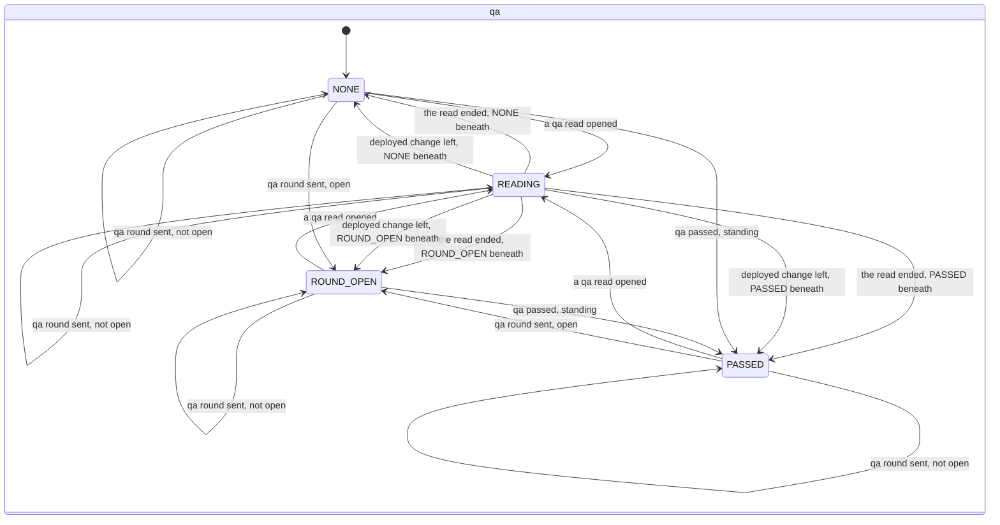

# The task qa chart

```mermaid
stateDiagram-v2
    state qa {
        state "NONE" as qa_NONE
        state "READING" as qa_READING
        state "ROUND_OPEN" as qa_ROUND_OPEN
        state "PASSED" as qa_PASSED
        [*] --> qa_NONE
        qa_NONE --> qa_READING : a qa read opened
        qa_READING --> qa_READING : a qa read opened
        qa_ROUND_OPEN --> qa_READING : a qa read opened
        qa_PASSED --> qa_READING : a qa read opened
        qa_READING --> qa_NONE : the read ended, NONE beneath
        qa_READING --> qa_NONE : deployed change left, NONE beneath
        qa_READING --> qa_ROUND_OPEN : the read ended, ROUND_OPEN beneath
        qa_READING --> qa_ROUND_OPEN : deployed change left, ROUND_OPEN beneath
        qa_READING --> qa_PASSED : the read ended, PASSED beneath
        qa_READING --> qa_PASSED : deployed change left, PASSED beneath
        qa_NONE --> qa_PASSED : qa passed, standing
        qa_NONE --> qa_NONE : qa passed, not standing
        qa_NONE --> qa_ROUND_OPEN : qa round sent, open
        qa_NONE --> qa_NONE : qa round sent, not open
        qa_READING --> qa_READING : qa passed, standing
        qa_READING --> qa_READING : qa passed, not standing
        qa_READING --> qa_READING : qa round sent, open
        qa_READING --> qa_READING : qa round sent, not open
        qa_ROUND_OPEN --> qa_PASSED : qa passed, standing
        qa_ROUND_OPEN --> qa_ROUND_OPEN : qa passed, not standing
        qa_ROUND_OPEN --> qa_ROUND_OPEN : qa round sent, open
        qa_ROUND_OPEN --> qa_ROUND_OPEN : qa round sent, not open
        qa_PASSED --> qa_PASSED : qa passed, standing
        qa_PASSED --> qa_PASSED : qa passed, not standing
        qa_PASSED --> qa_ROUND_OPEN : qa round sent, open
        qa_PASSED --> qa_PASSED : qa round sent, not open
    }
```
