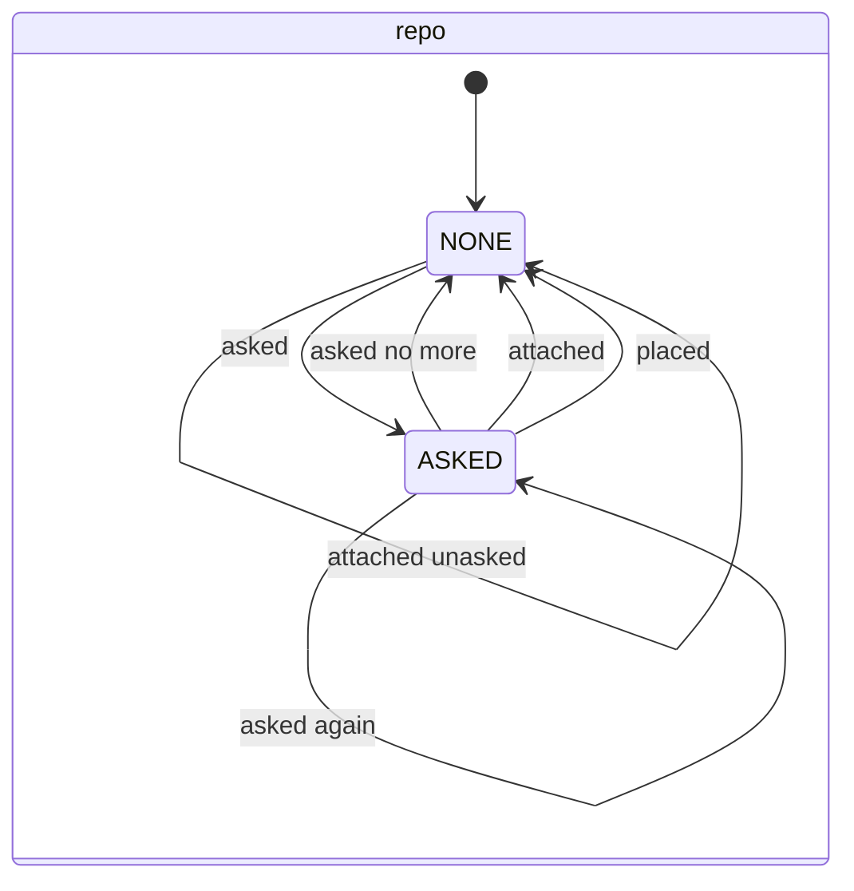

# The task repo chart

```mermaid
stateDiagram-v2
    state repo {
        state "NONE" as repo_NONE
        state "ASKED" as repo_ASKED
        [*] --> repo_NONE
        repo_NONE --> repo_ASKED : asked
        repo_ASKED --> repo_ASKED : asked again
        repo_ASKED --> repo_NONE : asked no more
        repo_ASKED --> repo_NONE : attached
        repo_NONE --> repo_NONE : placed
        repo_ASKED --> repo_NONE : placed
        repo_NONE --> repo_NONE : attached unasked
    }
```
