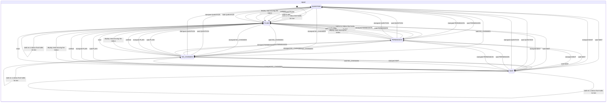

# The task report chart

```mermaid
stateDiagram-v2
    state report {
        state "QUESTION" as report_QUESTION
        state "PERMISSION" as report_PERMISSION
        state "NO_CHANGES" as report_NO_CHANGES
        state "WAIT" as report_WAIT
        state "PLAIN" as report_PLAIN
        [*] --> report_PLAIN
        report_QUESTION --> report_PLAIN : said on a status that holds its line
        report_QUESTION --> report_PERMISSION : said PERMISSION
        report_QUESTION --> report_PERMISSION : stamped PERMISSION
        report_QUESTION --> report_NO_CHANGES : said NO_CHANGES
        report_QUESTION --> report_NO_CHANGES : stamped NO_CHANGES
        report_QUESTION --> report_WAIT : said WAIT
        report_QUESTION --> report_WAIT : stamped WAIT
        report_QUESTION --> report_PLAIN : said PLAIN
        report_QUESTION --> report_PLAIN : stamped PLAIN
        report_QUESTION --> report_PLAIN : verified
        report_QUESTION --> report_PLAIN : deploy read moving the status
        report_PERMISSION --> report_PLAIN : said on a status that holds its line
        report_PERMISSION --> report_QUESTION : said QUESTION
        report_PERMISSION --> report_QUESTION : stamped QUESTION
        report_PERMISSION --> report_NO_CHANGES : said NO_CHANGES
        report_PERMISSION --> report_NO_CHANGES : stamped NO_CHANGES
        report_PERMISSION --> report_WAIT : said WAIT
        report_PERMISSION --> report_WAIT : stamped WAIT
        report_PERMISSION --> report_PLAIN : said PLAIN
        report_PERMISSION --> report_PLAIN : stamped PLAIN
        report_PERMISSION --> report_PLAIN : verified
        report_PERMISSION --> report_PLAIN : deploy read moving the status
        report_NO_CHANGES --> report_NO_CHANGES : said on a status that holds its line
        report_NO_CHANGES --> report_QUESTION : said QUESTION
        report_NO_CHANGES --> report_QUESTION : stamped QUESTION
        report_NO_CHANGES --> report_PERMISSION : said PERMISSION
        report_NO_CHANGES --> report_PERMISSION : stamped PERMISSION
        report_NO_CHANGES --> report_WAIT : said WAIT
        report_NO_CHANGES --> report_WAIT : stamped WAIT
        report_NO_CHANGES --> report_PLAIN : said PLAIN
        report_NO_CHANGES --> report_PLAIN : stamped PLAIN
        report_NO_CHANGES --> report_PLAIN : verified
        report_NO_CHANGES --> report_PLAIN : deploy read moving the status
        report_NO_CHANGES --> report_PLAIN : read
        report_WAIT --> report_WAIT : said on a status that holds its line
        report_WAIT --> report_QUESTION : said QUESTION
        report_WAIT --> report_QUESTION : stamped QUESTION
        report_WAIT --> report_PERMISSION : said PERMISSION
        report_WAIT --> report_PERMISSION : stamped PERMISSION
        report_WAIT --> report_NO_CHANGES : said NO_CHANGES
        report_WAIT --> report_NO_CHANGES : stamped NO_CHANGES
        report_WAIT --> report_PLAIN : said PLAIN
        report_WAIT --> report_PLAIN : stamped PLAIN
        report_WAIT --> report_PLAIN : verified
        report_WAIT --> report_PLAIN : deploy read moving the status
        report_WAIT --> report_PLAIN : read
        report_PLAIN --> report_PLAIN : said on a status that holds its line
        report_PLAIN --> report_QUESTION : said QUESTION
        report_PLAIN --> report_QUESTION : stamped QUESTION
        report_PLAIN --> report_PERMISSION : said PERMISSION
        report_PLAIN --> report_PERMISSION : stamped PERMISSION
        report_PLAIN --> report_NO_CHANGES : said NO_CHANGES
        report_PLAIN --> report_NO_CHANGES : stamped NO_CHANGES
        report_PLAIN --> report_WAIT : said WAIT
        report_PLAIN --> report_WAIT : stamped WAIT
    }
```
