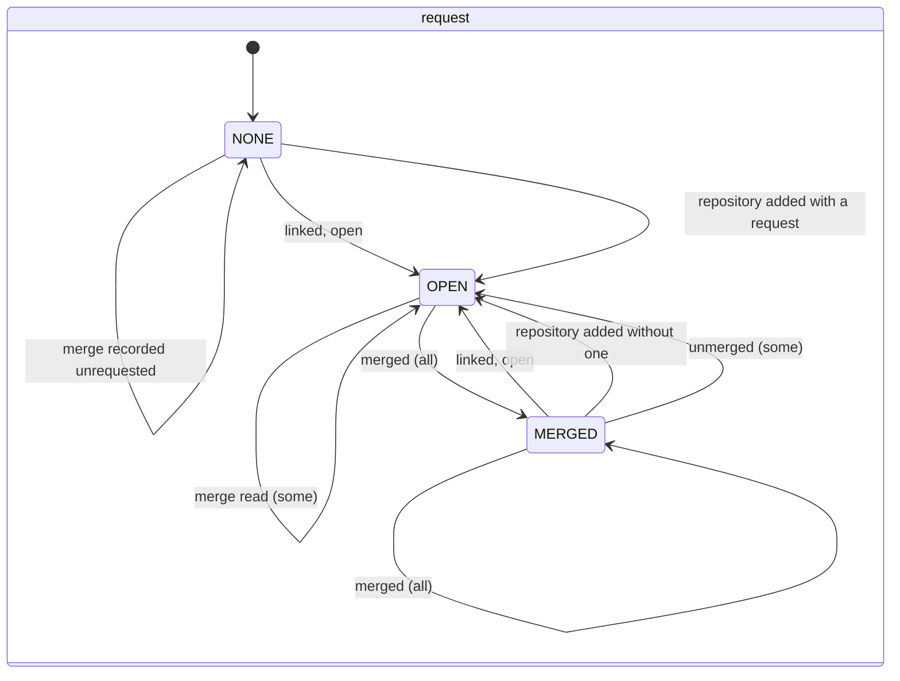

# The task request chart

```mermaid
stateDiagram-v2
    state request {
        state "NONE" as request_NONE
        state "OPEN" as request_OPEN
        state "MERGED" as request_MERGED
        [*] --> request_NONE
        request_NONE --> request_OPEN : linked, open
        request_NONE --> request_NONE : linked, standing
        request_OPEN --> request_OPEN : linked, open
        request_OPEN --> request_OPEN : linked, standing
        request_MERGED --> request_OPEN : linked, open
        request_MERGED --> request_MERGED : linked, standing
        request_NONE --> request_OPEN : repository added with a request
        request_MERGED --> request_MERGED : repository added with a request merged
        request_MERGED --> request_OPEN : repository added without one
        request_OPEN --> request_MERGED : merged (all)
        request_OPEN --> request_OPEN : merge read (some)
        request_MERGED --> request_MERGED : merged (all)
        request_MERGED --> request_OPEN : unmerged (some)
        request_NONE --> request_NONE : merge recorded unrequested
    }
```
