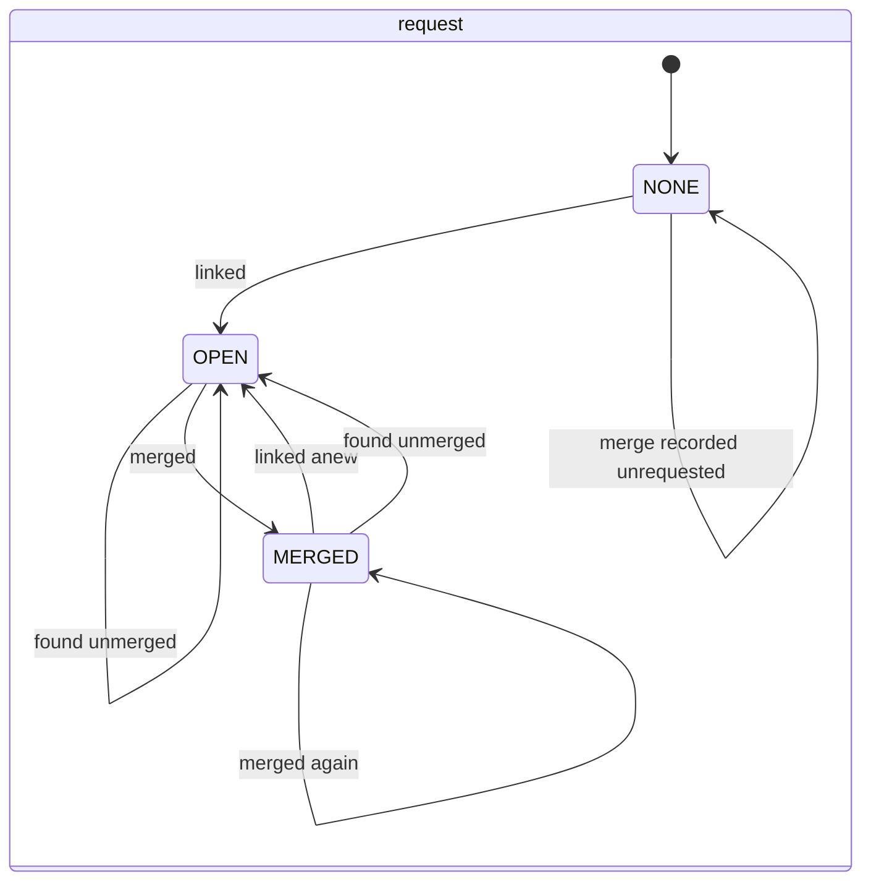

# The task request chart

```mermaid
stateDiagram-v2
    state request {
        state "NONE" as request_NONE
        state "OPEN" as request_OPEN
        state "MERGED" as request_MERGED
        [*] --> request_NONE
        request_NONE --> request_OPEN : linked
        request_OPEN --> request_OPEN : linked again
        request_MERGED --> request_OPEN : linked anew
        request_OPEN --> request_MERGED : merged
        request_OPEN --> request_OPEN : found unmerged
        request_MERGED --> request_MERGED : merged again
        request_MERGED --> request_OPEN : found unmerged
        request_NONE --> request_NONE : merge recorded unrequested
    }
```
