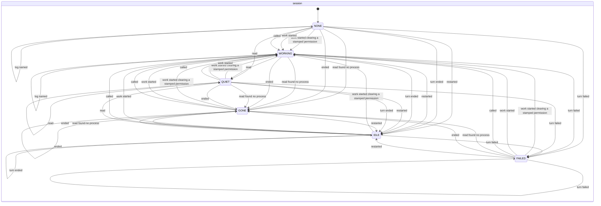

# The task session chart

```mermaid
stateDiagram-v2
    state session {
        state "NONE" as session_NONE
        state "WORKING" as session_WORKING
        state "IDLE" as session_IDLE
        state "QUIET" as session_QUIET
        state "FAILED" as session_FAILED
        state "GONE" as session_GONE
        [*] --> session_NONE
        session_NONE --> session_WORKING : work started clearing a stamped permission
        session_NONE --> session_WORKING : work started
        session_NONE --> session_NONE : asked
        session_NONE --> session_WORKING : called
        session_NONE --> session_NONE : reported
        session_NONE --> session_NONE : log named
        session_NONE --> session_QUIET : read
        session_NONE --> session_GONE : read found no process
        session_NONE --> session_GONE : ended
        session_NONE --> session_IDLE : restarted
        session_NONE --> session_IDLE : turn ended
        session_NONE --> session_FAILED : turn failed
        session_WORKING --> session_WORKING : work started clearing a stamped permission
        session_WORKING --> session_WORKING : work started
        session_WORKING --> session_WORKING : asked
        session_WORKING --> session_WORKING : called
        session_WORKING --> session_WORKING : reported
        session_WORKING --> session_WORKING : log named
        session_WORKING --> session_QUIET : read
        session_WORKING --> session_GONE : read found no process
        session_WORKING --> session_GONE : ended
        session_WORKING --> session_IDLE : restarted
        session_WORKING --> session_IDLE : turn ended
        session_WORKING --> session_FAILED : turn failed
        session_IDLE --> session_WORKING : work started clearing a stamped permission
        session_IDLE --> session_WORKING : work started
        session_IDLE --> session_IDLE : asked
        session_IDLE --> session_WORKING : called
        session_IDLE --> session_IDLE : reported
        session_IDLE --> session_IDLE : log named
        session_IDLE --> session_QUIET : read
        session_IDLE --> session_GONE : read found no process
        session_IDLE --> session_GONE : ended
        session_IDLE --> session_IDLE : restarted
        session_IDLE --> session_IDLE : turn ended
        session_IDLE --> session_FAILED : turn failed
        session_QUIET --> session_WORKING : work started clearing a stamped permission
        session_QUIET --> session_WORKING : work started
        session_QUIET --> session_QUIET : asked
        session_QUIET --> session_WORKING : called
        session_QUIET --> session_QUIET : reported
        session_QUIET --> session_QUIET : log named
        session_QUIET --> session_QUIET : read
        session_QUIET --> session_GONE : read found no process
        session_QUIET --> session_GONE : ended
        session_QUIET --> session_IDLE : restarted
        session_QUIET --> session_IDLE : turn ended
        session_QUIET --> session_FAILED : turn failed
        session_FAILED --> session_WORKING : work started clearing a stamped permission
        session_FAILED --> session_WORKING : work started
        session_FAILED --> session_FAILED : asked
        session_FAILED --> session_WORKING : called
        session_FAILED --> session_FAILED : reported
        session_FAILED --> session_FAILED : log named
        session_FAILED --> session_FAILED : read
        session_FAILED --> session_GONE : read found no process
        session_FAILED --> session_GONE : ended
        session_FAILED --> session_IDLE : restarted
        session_FAILED --> session_FAILED : turn failed
        session_GONE --> session_WORKING : work started clearing a stamped permission
        session_GONE --> session_WORKING : work started
        session_GONE --> session_GONE : asked
        session_GONE --> session_WORKING : called
        session_GONE --> session_GONE : reported
        session_GONE --> session_GONE : log named
        session_GONE --> session_GONE : read
        session_GONE --> session_GONE : read found no process
        session_GONE --> session_GONE : ended
        session_GONE --> session_IDLE : restarted
    }
    %% derived ask
```
