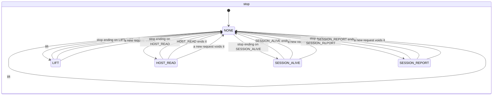

# The task stop chart

```mermaid
stateDiagram-v2
    state stop {
        state "NONE" as stop_NONE
        state "LIFT" as stop_LIFT
        state "HOST_READ" as stop_HOST_READ
        state "SESSION_ALIVE" as stop_SESSION_ALIVE
        state "SESSION_REPORT" as stop_SESSION_REPORT
        [*] --> stop_NONE
        stop_NONE --> stop_NONE : lift
        stop_NONE --> stop_LIFT : stop ending on LIFT
        stop_LIFT --> stop_NONE : lift
        stop_LIFT --> stop_NONE : LIFT ends it
        stop_LIFT --> stop_NONE : a new request voids it
        stop_NONE --> stop_HOST_READ : stop ending on HOST_READ
        stop_HOST_READ --> stop_NONE : lift
        stop_HOST_READ --> stop_NONE : HOST_READ ends it
        stop_HOST_READ --> stop_NONE : a new request voids it
        stop_NONE --> stop_SESSION_ALIVE : stop ending on SESSION_ALIVE
        stop_SESSION_ALIVE --> stop_NONE : lift
        stop_SESSION_ALIVE --> stop_NONE : SESSION_ALIVE ends it
        stop_SESSION_ALIVE --> stop_NONE : a new request voids it
        stop_NONE --> stop_SESSION_REPORT : stop ending on SESSION_REPORT
        stop_SESSION_REPORT --> stop_NONE : lift
        stop_SESSION_REPORT --> stop_NONE : SESSION_REPORT ends it
        stop_SESSION_REPORT --> stop_NONE : a new request voids it
    }
```
