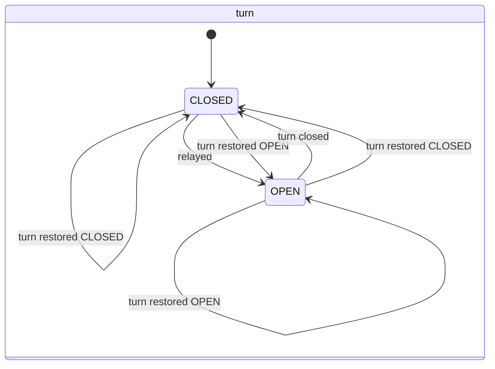

# The task turn chart

```mermaid
stateDiagram-v2
    state turn {
        state "CLOSED" as turn_CLOSED
        state "OPEN" as turn_OPEN
        [*] --> turn_CLOSED
        turn_CLOSED --> turn_OPEN : relayed
        turn_CLOSED --> turn_CLOSED : turn closed
        turn_CLOSED --> turn_CLOSED : turn restored CLOSED
        turn_CLOSED --> turn_OPEN : turn restored OPEN
        turn_OPEN --> turn_OPEN : relayed
        turn_OPEN --> turn_CLOSED : turn closed
        turn_OPEN --> turn_CLOSED : turn restored CLOSED
        turn_OPEN --> turn_OPEN : turn restored OPEN
    }
```
