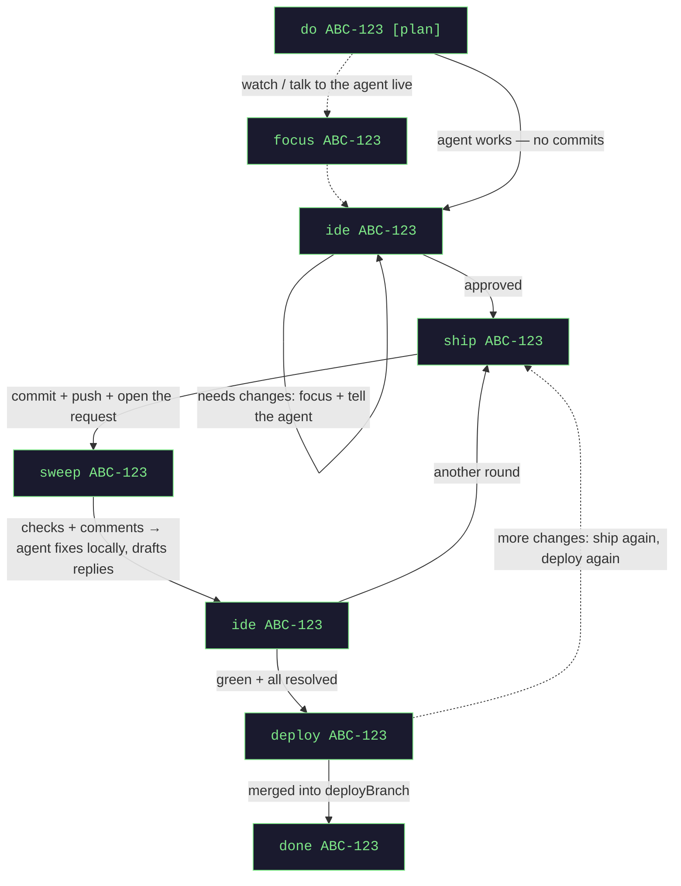

# Usage

[← README](../README.md)

jagt has two surfaces over one core, chosen with `orchestrator.ui`:

- `web` (default) — the **board** at `http://localhost:8290`
- `tui` — the full-screen **console** in your terminal
- `both` — serves the board, then hands the terminal to the console

Whose move it is, and which actions are legal, are computed in one place. The two surfaces can never tell you
different things — anything one can do and the other cannot is a bug.

## The board

Every task is one card, ordered by alias. **A card never moves because its status changed** — only when a task
is created or closed. Where a task is in the pipeline is one line of counts above the grid
(build → review → check → ready → deploy → done), so nothing jumps around while you read it.

Each card shows:

- whose move it is, the status, and how long it has been in it
- what jagt has spent on it
- links to the ticket and the review request
- a line when the agent has left **drafted review replies** — click it to read them

Every card carries exactly the actions that are legal right now, the obvious one highlighted, in two rows:
what moves the task along (ship … done), then what only looks at it (focus, ide, diff, restart agent).

**Filtering, not sorting.** There is no sort control — a position you have learnt is worth more than any order
a click can produce. Type in the filter box (`/` focuses it, `Esc` clears) to match an alias, ticket number or
title, and tick *needs my action* for what is yours. The page never polls; the backend pushes changes.

`deploy` and `done` ask for confirmation — one writes to a shared branch, the other deletes a worktree.

**Focus** selects the agent's tmux window. Install ttyd and set `orchestrator.web-terminal.enabled: true` and
the board opens that session **over the board itself** — a real terminal you can type into, so answering an
agent no longer means finding another window. Closing the panel does not stop the agent; it is only a view.

> [!NOTE]
> `quit` is the one console verb the board deliberately lacks. Stopping the backend belongs to whoever started
> the process. Nothing is lost either way — agents live in tmux and keep working when the backend goes away.

## The console

`--orchestrator.ui=tui` gives the full-screen terminal UI. The dashboard repaints the moment an agent reports
in, and is always on screen.

- **Shift+←/→** switches between agent windows
- every task gets a short alias (`p1`, `s2`) usable anywhere instead of the ticket id
- closing the terminal window only detaches the viewer — agents keep running; kill them with `done`

## Commands

### Per task

| command | what it does |
|---------|--------------|
| `do <ticket> [plan] [notes]` | read the ticket, cut a worktree, launch an agent. `plan` = plan mode |
| `do <ticket> from <branch>` | cut from `<branch>` and target it in the request — for stacking on a feature branch |
| `do <ticket> <projA>,<projB>` | one task, one agent, a worktree per repository |
| `focus <ticket>` | jump to the agent's session and talk to it directly |
| `ide <ticket>` | open the worktree as a project — Git → Local Changes is the live diff |
| `ide <ticket> diff` | a static snapshot against the deploy branch |
| `ship <ticket>` | commit, push, open or update the review request |
| `sweep <ticket>` | pull checks + comments; the agent fixes locally and drafts replies |
| `replies [ticket]` | every comment of the round with its verdict and the reply drafted for it |
| `resume <request-url>` | adopt an existing review request: its branch, its commits, its target |
| `deploy <ticket>` | merge the task branch into `deployBranch` and push |
| `revert <ticket>` | undo that deploy with a revert commit |
| `respawn <ticket>` | restart a dead agent session |
| `done <ticket>` | close the task: session, worktree and state gone (the branch stays) |

### Global

| command | what it does |
|---------|--------------|
| `status` | the task dashboard |
| `stats` | what jagt's own model calls cost, per task, plus cycle time |
| `activity` | what jagt did unattended |
| `jobs` | every scheduled job, its cadence, last and next run |
| `help` | command reference and recovery cheatsheet |
| *anything else* | free text — see below |

Plain text over HTTP any time:

```sh
curl -s localhost:8290/status
curl -s localhost:8290/stats
curl -s localhost:8290/api/commands/activity
```

### Free text

Type a sentence instead of a command (the board's **Ask** button, or `⌘K`) and a model maps it onto **exactly
one** of the commands above. jagt then runs it through the same gate a button uses, and tells you what it
understood first: *understood as `ship a1` — …*

The palette completes the grammar as you type and says whether the line will run (green) or why it will not
(`no task "a9"`, `ship needs a task`). **A line that parses is executed as typed, with no model call** — only
real prose costs anything, and a single mistyped word is treated as a typo, not a request.

## The review loop



`ship → sweep → ide → ship` repeats once per review round until CI is green and every thread is resolved.
Then `deploy`, then `done`.

jagt refuses a move that makes no sense for a task's current status, with a sentence rather than a git error.

## Notes on the tricky ones

**`ship`.** The agent does the work with its own code-host tools: commit (title from `mrTitlePattern`), push
the task branch, and open or update one request **per repository** — jagt hands over the instruction and waits
in SHIPPING until the agent reports the links back. Posting the drafted replies is part of the same
instruction.

**`sweep` and drafted replies.** A sweep only **reads and drafts**. The agent fixes locally and writes its
intended answers to `review_replies.md`; nothing is pushed or posted until you `ship`. Read them with
`replies` first — `ship` is what sends them. The old spelling `review` still works.

**A review round is a judgement, not a work order.** The agent may fix a comment, change nothing and say why,
or ask you. It does not implement a reviewer's suggestion it thinks is wrong.

**`resume`.** Takes over a review request that already exists — reopened, or someone else's work. Its branch
comes back with the commits on it and the request is linked, not reopened. Its target branch is remembered,
so the next `ship` updates that request instead of opening a second one.

**`deploy` on conflict.** Nothing is pushed. The task goes `DEPLOY_CONFLICT` and `ide <ticket>` opens the
**deploy** worktree — resolve, `git add`, then `deploy` again. Your task branch and request are untouched.
Deploy is a dev step, not the end: ship again and deploy again as often as you like.

**`revert`.** Reverts the merge commit that `deploy` created and pushes it. It only *adds* a commit — no
history rewrite, no force-push — and your branch survives, so the normal follow-up is fix and `ship` again.
It refuses, writing nothing, when the commit is already reverted, is not on the branch, or the revert
conflicts.

**Multi-repo tasks.** One task, one agent session, a worktree per repository (the session runs in the first
one named). `ship` opens a request per repository; `sweep` reports them as one round, as far along as the
least finished one.
