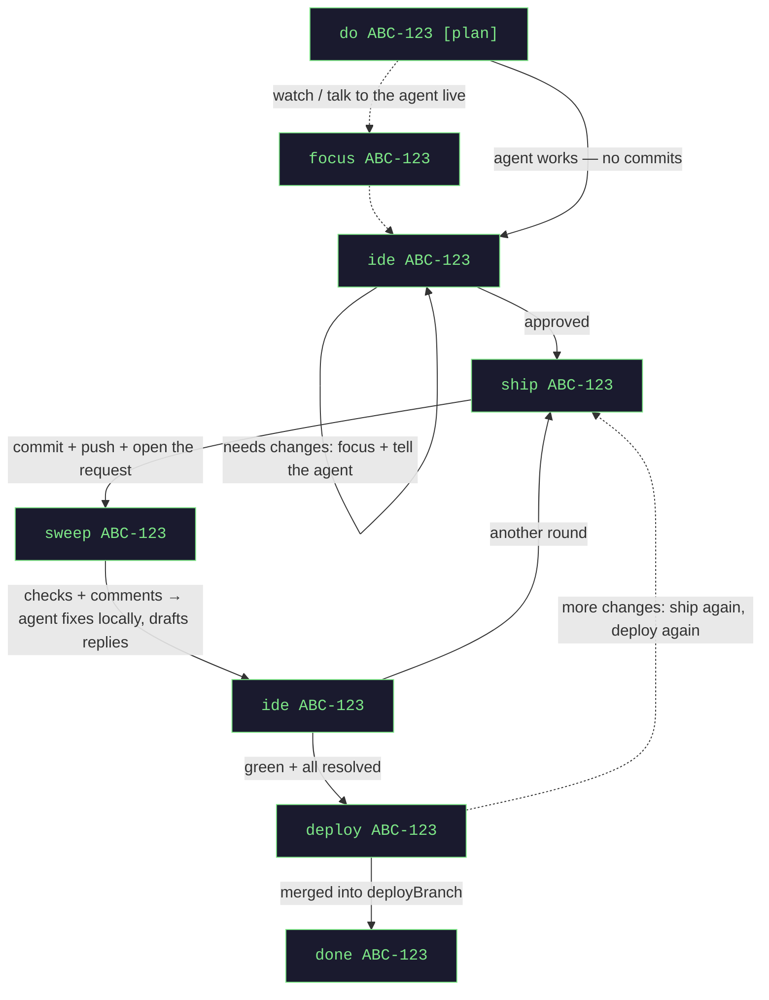

# Usage

[← README](../README.md)

jagt has one surface: the **board** at `http://localhost:8290`.

## The board

Every task is one card, ordered by alias. **A card never moves because its status changed** — only when a task
is created or closed. One line of counts above the grid holds the pipeline
(build → review → check → ready → deploy → done).

A card shows whose move it is, the status and how long it has been in it, what jagt has spent, links to the
ticket and the review request, and a line to click when the agent has left **drafted review replies**. It
carries exactly the actions legal right now, the obvious one highlighted, in two rows: what moves the task
along (ship … done), then what only looks at it (focus, ide, diff, restart agent). `deploy` and `done` ask for
confirmation — one writes to a shared branch, the other deletes a worktree.

**Filtering, not sorting.** There is no sort control. Type in the filter box (`/` focuses it, `Esc` clears) to
match an alias, ticket number or title, and tick *needs my action* for what is yours. The page never polls; the
backend pushes changes.

**Focus** selects the agent's tmux window in kitty and raises it; the toast names the window it moved to.
**Shift+←/→** switches between agent windows there, and closing the viewer only detaches it — agents live in
tmux and keep working; kill them with `done`. Every task also gets a short alias (`p1`, `s2`) usable anywhere
instead of the ticket id.

There is no verb for stopping the backend — that belongs to whoever started the process.

## Commands

### Per task

| command | what it does |
|---------|--------------|
| `do <ticket> [plan] [notes]` | read the ticket, cut a worktree, launch an agent. `plan` = plan mode |
| `do <ticket> from <branch>` | cut from `<branch>` and target it in the request — for stacking on a feature branch |
| `do <ticket> <projA>,<projB>` | one task, one agent, a worktree per repository |
| `do <ticket> recreate` / `resume` | the branch already exists: cut it fresh, or take over its commits |
| `focus <ticket>` | jump to the agent's session and talk to it directly |
| `ide <ticket>` | open the worktree as a project — Git → Local Changes is the live diff |
| `ide <ticket> diff` | a static snapshot against the branch the request targets |
| `ship <ticket>` | commit, push, open or update the review request |
| `sweep <ticket>` | pull checks + comments; the agent fixes locally and drafts replies |
| `replies [ticket]` | every comment of the round with its verdict and the reply drafted for it |
| `resume <request-url>` | adopt an existing review request: its branch, its commits, its target |
| `deploy <ticket>` | merge the task branch into `deployBranch` and push |
| `revert <ticket>` | undo that deploy with a revert commit |
| `respawn <ticket>` | restart a dead agent session |
| `done <ticket>` | close the task: session, worktree and state gone (the branch stays) |

### Global

| command | what it does |
|---------|--------------|
| `stats` | what jagt's own model calls cost, per task, plus cycle time |
| `activity` | what jagt did unattended |
| `jobs` | every scheduled job, its cadence, last and next run |
| `help` | command reference and recovery cheatsheet |
| *anything else* | free text — see below |

Every report is plain text over HTTP any time:

```sh
curl -s localhost:8290/api/commands/stats
curl -s localhost:8290/api/commands/activity
```

### Free text

Type a sentence instead of a command (the board's **Ask** button, or `⌘K`) and a model maps it onto **exactly
one** of the commands above, runs it through the same gate a button uses, and says what it understood:
*understood as `ship a1` — …* The palette completes the grammar as you type and says whether the line will run
(green) or why it will not (`no task "a9"`, `ship needs a task`). **A line that parses is executed as typed,
with no model call**; a single mistyped word is treated as a typo, not as prose.

## The review loop



`ship → sweep → ide → ship` repeats once per review round until CI is green and every thread is resolved, then
`deploy`, then `done`. jagt refuses a move that makes no sense for the task's status, with a sentence rather
than a git error.

## Notes on the tricky ones

**`ship`** is the agent's own work, with its own code-host tools: commit (title from `mrTitlePattern`), push
the task branch, open or update one request **per repository**, post the drafted replies. jagt waits in
SHIPPING for the links.

**`sweep`** only **reads and drafts**: the agent fixes locally and writes its intended answers to
`review_replies.md`; nothing is pushed or posted until you `ship`. Read them with `replies` first. The old
spelling `review` still works.

**A review round is a judgement, not a work order.** The agent may fix a comment, change nothing and say why,
or ask you; it does not implement a suggestion it thinks is wrong.

**`resume`** takes over a review request that already exists — reopened, or someone else's work. Its branch
comes back with the commits on it, the request is linked rather than reopened, and its target branch is
remembered, so the next `ship` updates it rather than opening a second.

**`deploy` on conflict** pushes nothing: the task goes `DEPLOY_CONFLICT` and `ide <ticket>` opens the **deploy**
worktree — resolve, `git add`, `deploy` again. Your task branch and request are untouched, and you may ship and
deploy again as often as you like.

**`revert`** reverts the merge commit `deploy` created and pushes it. It only *adds* a commit — no history
rewrite, no force-push — and your branch survives, so the normal follow-up is fix and `ship` again. It refuses,
writing nothing, when the commit is already reverted, is not on the branch, or the revert conflicts.

**Multi-repo tasks.** One task, one agent session, a worktree per repository (the session runs in the first one
named). `ship` opens a request per repository; `sweep` reports them as one round, as far along as the least
finished one.
